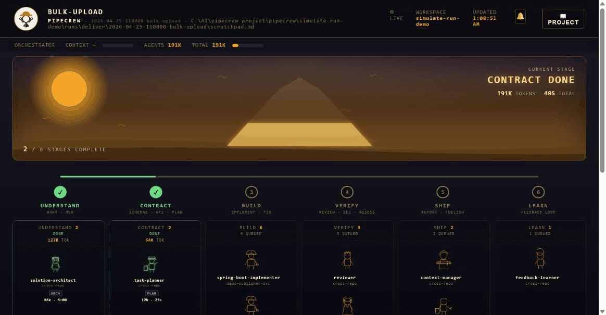

<div align="center">


<pre>
██████   ██████  ██████   ██████   █████  ██████   ██████  ██   ██
██   ██    ██    ██   ██  ██      ██      ██   ██  ██      ██   ██
██████     ██    ██████   █████   ██      ██████   █████   ██ █ ██
██         ██    ██       ██      ██      ██  ██   ██      ███████
██       ██████  ██       ██████   █████  ██   ██  ██████   ██ ██ 
</pre>

### A crew that learns your platform

A **self-learning, multi-repo agent crew** for [Claude Code](https://claude.ai/claude-code) — and [Cursor](https://cursor.com).
Hand it one feature; it ships across every repo that feature touches — engineering its own
context and learning your platform, so **every run starts smarter than the last**.

[](https://pipecrew.ai)
[](https://claude.ai/claude-code)
[](https://github.com/pipecrew-ai/pipecrew/releases/latest)
[](LICENSE)

[**Try it free**](#see-it-work--free) · [**Install**](#install) · [**First feature**](#your-first-feature) · [**What do you want to do?**](#what-do-you-want-to-do) · [**Cost & safety**](#three-questions-youre-already-asking) · [**Cheatsheet**](docs/CHEATSHEET.md)

</div>

---

> **Not a faster one-shot agent** — a crew that fans out across your repos, engineers its own
> context, and gets sharper every run. One feature in, PRs across every repo out.

<p align="center"></p>

Nothing a one-shot agent learns survives the session. Your platform's conventions, the gotchas,
the way you *always* do it — re-explained every run, like onboarding a new hire on a loop. And the
moment a feature spans more than one repo, the agent that "finished" the backend has no idea the
frontend and the contract drifted out from under it.

PipeCrew fixes both — with three moves:

- **Multi-repo, multi-agent** — one stack-specialized implementer *and reviewer* per repo, each in its own git worktree, all building against the same contract. A cross-repo assessor reads every diff together and catches the mismatch no single reviewer can see.
- **Context engineered** — state lives in files, not the chat. Each agent loads only its slice; the platform map, conventions, and decisions live on disk and are read on demand.
- **Continuous learning** — feed a merged PR back and PipeCrew proposes updates to its durable memory, which you approve per finding. Run #2 beats run #1.

You stay the **director**, approving at gates. The orchestrator job moves to PipeCrew.

## See it work — free

PipeCrew ships its own demo. One command generates a complete fake workspace with realistic
run artifacts and opens the live dashboard — the crew queuing, building, finishing — at
**zero agent cost**:

```bash
claude plugin install https://github.com/pipecrew-ai/pipecrew
/simulate-run
```

Sixty seconds, no tokens spent, and you've seen the whole pipeline before onboarding a single repo.

## Install

**Claude Code:**

```bash
claude plugin install https://github.com/pipecrew-ai/pipecrew
```

**Cursor** (v2.5+) — same repo, dual-target: `Customize → Plugins → /add-plugin` → paste the repo URL.
All 20 skills and the 35-agent crew ship to both; a few lifecycle hooks are Claude-Code-only for now
([details](docs/CHEATSHEET.md#cursor-notes)).

Updates ship as [GitHub Releases](https://github.com/pipecrew-ai/pipecrew/releases) — enable
auto-update once via `/plugin` → Marketplaces → pipecrew, or see [updating](docs/CHEATSHEET.md#updating).

## Your first feature

**1. Onboard — once per project**, from the directory that holds your repos:

```bash
/discover /path/to/your/repos
```

Scans the repos, detects tech stacks, asks a few domain questions, and writes the durable layer
beside your code: workspace config, a `platform.md` map of your domain, per-repo `AGENTS.md`
(the tool-agnostic standard — Claude Code, Cursor, Codex and 30+ agents read it natively), and
domain-specialized agents. Not sure *what* to build yet? Start with `/brainstorm` instead.

**2. Deliver:**

```bash
/deliver "publishers can choose contract type"
```

Eight phases run automatically — requirements → architecture → **contracts & specs land before
any code is written** → plan → parallel build (backend + frontend + mock + infra, each in its own
worktree) → per-repo review → cross-repo assessment → report + draft PRs. You approve at each
gate; a live dashboard at `localhost:5173` shows the crew work in real time.
Full phase-by-phase detail: [cheatsheet](docs/CHEATSHEET.md#the-deliver-pipeline).

**3. Close the loop** — after the PR merges:

```bash
/learn --pr <url>
```

PipeCrew distills what reviewers changed into durable conventions — tier-classified, approved by
you per finding — so the next run doesn't repeat the mistake. This is the pillar the other two
exist for.

## What do you want to do?

| You want… | Run |
|---|---|
| See the whole thing on a demo, free | `/simulate-run` |
| Ideas — what to build next, or how to build it | `/brainstorm` (`--technical` for approaches) |
| A greenfield project scaffolded from an idea | `/scaffold` |
| Your project onboarded | `/discover` |
| A feature shipped end-to-end across repos | `/deliver "<description>"` |
| A small, well-specified mechanical change | `/patch` |
| A branch or PR reviewed in one repo | `/review` |
| A feature branch verified across repos | `/assess` |
| Acceptance tests authored into a durable suite | `/design-tests` |
| The suite run — regression, UAT sign-off, prod smoke | `/run-regression` |
| A bug investigated from a symptom (read-only) | `/troubleshoot "<symptom>"` |
| Feedback captured into durable conventions | `/learn` |
| Context docs audited or refreshed after drift | `/context-refresh` |
| Architecture diagrams generated or refreshed | `/draw-diagram` |
| Team memory shared via a private GitHub repo | `/memory-sync enable` |
| A teammate onboarded in one command | `/join <memory-repo-url>` |
| The current run, watched live | `/site-view` |
| Every Claude Code session on the machine, watched | `/siteview-fleet` (`-list`, `-cleanup`) |

Every row is a standalone skill — the pipeline is just the biggest one. Full reference with
flags, agents, and supported stacks: [**docs/CHEATSHEET.md**](docs/CHEATSHEET.md).

## Three questions you're already asking

**What does a run cost?** You'll know exactly: every run ends with a report that leads with real
dollars — orchestrator vs agents, cache-read share, per-agent token breakdown — priced from a
`pricing.json` rate card shipped as data. The dashboard shows a live context gauge, and long runs
get an explicit gate suggesting a clean stop + `/deliver --resume` instead of degrading quietly.

**Is it safe to let a crew loose on my repos?** Every phase ends at a gate you approve. PRs are
drafts. `/troubleshoot` is read-only *by hook*, not by promise. Terraform plans are artifacts —
the crew never applies. Even `--auto-approve` mode only auto-approves a safe allowlist, never
pushes, deletes, or deploys. And every pipeline commit carries `PipeCrew-Run-Id` +
`PipeCrew-Version` trailers, so `git log` always answers "which run touched this?"

**My stack isn't on the list.** Twelve stacks ship with paired implementers + reviewers
(Spring Boot, React, Next.js, NestJS, FastAPI, Flask, Django, Python workers, CDK, Terraform,
mocks, schemas) — and for anything else (Rails, Phoenix, Go, .NET, Kotlin, your in-house
framework), `/discover` reads your repo's conventions and **auto-generates a tailored
implementer**, no plugin change required.

## Learn more

- [**Cheatsheet**](docs/CHEATSHEET.md) — every skill, flag, agent, stack, and phase on one page
- [**Design docs**](docs/design/) — context engineering, shared memory, workspace registry, test cases
- [**CHANGELOG**](CHANGELOG.md) · [**pipecrew.ai**](https://pipecrew.ai)

## License

[Apache 2.0](LICENSE) · Learn more at **[pipecrew.ai](https://pipecrew.ai)**
