# PipeCrew — Detailed `/discover` Flow

Companion to `plugin-flow-detailed.md` (which covers `/deliver`). Same level of zoom, focused on the one-time onboarding pipeline that produces the workspace `/deliver` then consumes.

---

## 1. What `/discover` is for

A workspace is a **directory of related repos that ship features together**. Onboarding teaches PipeCrew about that workspace once, then `/deliver` reuses the artifacts forever.

After `/discover` completes, you get:

```
{workspace_root}/{slug}/
├── config.json                      ← machine config — drives /deliver's auto-detection
├── context/
│   ├── platform.md                  ← architecture context (read by SA in design mode)
│   ├── audit-findings.md            ← real bugs spotted opportunistically during onboarding
│   ├── diagrams/                    ← workspace architecture diagrams
│   │   ├── architecture.mmd         ← detailed Mermaid topology
│   │   └── architecture-overview.mmd ← 4-subgraph overview
│   ├── design-system/{component-catalog,tokens,patterns}.md  ← (B3, frontend only)
│   └── adrs/                        ← architecture decision records (filled by /deliver Phase 2 ADR gate)
│       ├── INDEX.md                 ← one-line-per-ADR index, read by SA in Step 0
│       └── ADR-NNN-<slug>.md        ← one file per ADR
├── agents/
│   ├── {slug}-product-owner.md      ← workspace-tailored agents
│   ├── {slug}-assessor.md
│   └── {slug}-ux-consultant.md
├── agent-memory/
│   └── solution-architect/          ← rare architect-private notes (thin)
└── runs/discover/{run_id}/
    ├── scratchpad.md
    ├── checkpoints.jsonl
    ├── outputs/
    │   ├── platform-draft.md
    │   ├── divergences.md
    │   └── design-system-draft.md
    └── report.md                    ← Phase D summary

# Plus per-repo:
{repo}/CLAUDE.md                     ← mandatory — agents read first
{repo}/agent-context/                ← optional — deep architecture docs
```

`run_id` format: `{YYYY-MM-DD-HHMMSS}-{workspace-slug}`. Same-second collision → `-2`, `-3`. Stable workspace-level outputs (`config.json`, `platform.md`, `agents/`) live at workspace root, not under `runs/`. Per-run artifacts live under `runs/discover/{run_id}/`.

---

## 2. The pipeline at a glance

```
Pre-phase 0:  Workspace root + name + usage gate + run dir
Phase Greenfield:  Brainstorm + scaffold (only if --greenfield OR zero repos found)
Phase A:      Repo Discovery — scan parent dirs, detect tech stacks
Phase B1:     Domain Questions — 3 questions (name was captured in Pre-phase 0)
Phase B2:     Architect Discovery — solution-architect reads code → platform.md
Phase B2.6:   Observability extraction — IaC scan → OBSERVABILITY block in platform.md
Phase B3:     Design System (frontend only) — components / tokens / patterns
Phase C:      Generation — config.json + CLAUDE.md per repo + domain agents + agent-context
Phase D:      Verification — validate, audit summary, write report.md
```

Each phase has its own file under `skills/discover/phases/`. Orchestrator loads only the active phase file (lazy loading — same context-hygiene rule as `/deliver`).

---

## 3. Pre-phase 0 — the gate before anything else

Three steps that MUST run before Phase A or any file write.

### Step 0.0 — Resolve workspace root

```bash
node {plugin}/scripts/workspace-root.js --check
```

| Exit code | Meaning |
|---|---|
| 0 | Already configured (or `$PIPECREW_WORKSPACE_ROOT` is set) |
| 2 | First-time use — orchestrator asks: *"Where should PipeCrew store workspaces? Default: `~/.claude/pipecrew/workspaces`"* and persists with `workspace-root.js --set=<path>` |

Persisted to `~/.claude/pipecrew/config.json`. Future `/discover` and `/deliver` runs reuse the same root without re-prompting.

### Step 0.1 — Workspace name

Asked once. Used to derive:
- `workspace.name` — display name
- `workspace.slug` — kebab-case, ≤20 chars, used as directory name and agent prefix
- `run_id` — `{YYYY-MM-DD-HHMMSS}-{slug}`

### Step 0.2 — Usage gate

Reads `~/.claude/stats-cache.json`, sums today's tokens per model, compares against the observed daily ceiling (max in history). If any model > **80%** of ceiling, warn + ask "continue anyway?". **Warn-only — never hard-block.**

Why: a full onboarding is the most expensive flow in the plugin (architect discovery + stack discovery + design system + per-repo CLAUDE.md generation). Easily 200-400k Opus tokens. Better to surface that risk before the run starts than mid-Phase-C.

### Step 0.3 — Create run directory + emit `run_start`

```bash
mkdir -p {workspace_root}/{slug}/runs/discover/{run_id}/outputs
```

Emit `run_start` to `checkpoints.jsonl`, then write the initial scratchpad. Then enter Phase A.

---

## 4. Phase Greenfield — when there's nothing to discover

Triggered by `--greenfield` flag OR auto-triggered when Phase A scans the parent dirs and finds zero repos.

```mermaid
---
title: Phase Greenfield — brainstorm + scaffold (runs only when no repos exist or --greenfield is passed)
---
flowchart LR
  classDef phase fill:#e7f5ff,stroke:#1971c2,color:#000
  classDef agent fill:#f3d9fa,stroke:#9c36b5,color:#000
  classDef artifact fill:#ffe0e9,stroke:#c2255c,color:#000

  brain[product-brainstormer agent]:::agent
  brief[(PROJECT_BRIEF.md)]:::artifact
  scaff[/scaffold skill]:::phase
  repos[(actual repos created)]:::artifact

  user([User: rough idea])
  user --> brain
  brain -->|interactive Q&A| brief
  brief --> scaff
  scaff -->|generates from templates| repos
  repos -->|continue to Phase A| A[Phase A: Repo Discovery]:::phase
```

`pipecrew:product-brainstormer` interrogates the user's rough idea ("I want to build X for Y"), produces a structured `PROJECT_BRIEF`, then `/scaffold` materializes the actual repos. After scaffolding, the orchestrator drops into Phase A normally — the freshly-scaffolded repos are discovered like any others.

---

## 5. Phase A — Repo Discovery

Scans every `parent_dir` argument (default: cwd), looking for git repos plus loose project dirs.

**Detection per repo:**

| Signal | Detected as |
|---|---|
| `pom.xml` + `src/main/java` | `api-service.spring-boot` |
| `package.json` + `nest` dep | `api-service.nestjs` |
| `package.json` + `next` dep | `frontend.nextjs` |
| `package.json` + `react` dep + Vite/CRA | `frontend.react` |
| `package.json` + `express` + name contains "mock" | `mock-server` |
| `pyproject.toml` + `fastapi` dep | `api-service.fastapi` |
| `pyproject.toml` + `flask` dep | `api-service.flask` |
| `manage.py` + `django` dep | `api-service.django` |
| Lambda handler + no HTTP framework | `worker.python` |
| `cdk.json` | `infrastructure.cdk` |
| `*.tf` + `terraform.tfstate` references | `infrastructure.terraform` |
| `schemas/`, `*.avsc`, `*.proto`, no app code | `contract` |

For each repo, also collect:
- Existing `CLAUDE.md` (don't overwrite — read it instead)
- Existing `agent-context/` (preserve)
- Detected spec file path (`openapi.yaml`, `swagger.json`, etc.)

Confirm the detection table with the user. They can correct types or add roles. Then write `## Discovered Repos` to scratchpad.

---

## 6. Phase B — Domain + Architect

### B1 — Three Questions

The opener echoes the workspace name back so a typo can be corrected:

1. **Domain in one sentence** — what it does
2. **User roles** — comma-separated list
3. **Languages + RTL** — i18n config

Three questions, no more. The architect handles entities, API design, deployment, etc. — those are NOT the user's job.

### B2 — Architect Discovery (the heavy lift)

`solution-architect` invoked with **MODE: discovery** (vs the **MODE: design** invocation that runs in `/deliver` Phase 2).

```
SA discovery prompt template:

  MODE: discovery
  Workspace: {name}
  Domain: {one-sentence}
  User roles: {list}
  Languages: {list}
  
  REPOS TO INSPECT:
  {for each confirmed repo}
    - {key} ({type}): {abs path}
      spec_file: {path or none}
  
  OUTPUT: {workspace_root}/{slug}/context/platform.md
  Use the section template documented in your system prompt.
  Include MAPPER_REPORT block at the bottom for the architecture-mapper handoff.
```

Architect reads actual code (not just filenames), produces a multi-section `platform.md`:

| Section | Content |
|---|---|
| `## Overview` | One paragraph — what the platform does |
| `## Service Map` | Table of every service + role + responsibility |
| `## Domain Entities` | Top 8-15 entities with cardinalities and ownership |
| `## Auth Model` | Identity provider, token format, role hierarchy |
| `## Data Patterns` | DB-per-service vs shared, caching, search |
| `## Async Patterns` | Queues, topics, event flows |
| `## Established Patterns` | Recurring conventions across repos |
| `<!-- BEGIN OBSERVABILITY -->` | JSON block — populated by Phase B2.6 |
| `## Stack Divergences` | Populated by Phase B2.5 |
| `## Open Questions` | Things SA flagged for human follow-up |

### B2.6 — Observability extraction

Runs `extract-observability.js` against every infra repo (CDK / Terraform / k8s manifests / docker-compose / Ansible). Produces a draft for the user to curate (trace correlation header, dashboards, runbook locations). Writes the result as the `<!-- BEGIN OBSERVABILITY --> … <!-- END OBSERVABILITY -->` block in `platform.md`.

`--refresh-observability --workspace=<slug>` re-runs ONLY this phase. Backfills if the workspace was discovered before B2.6 existed.

### B3 — Design System (frontend only)

Skipped if no frontend repo. For frontends, scans:
- Component library (storybook stories, exported components)
- Design tokens (CSS vars, theme files, Tailwind config)
- Layout patterns (page templates, list/detail conventions)
- i18n setup (key namespaces, RTL handling)

Produces `context/design-system/{component-catalog,tokens,patterns}.md` and `agent-context/design-system.md` per frontend repo. The `{slug}-ux-consultant` agent reads these in `/deliver` Phase 5b before the implementer runs.

---

## 7. The Audit Findings contract — onboarding's secret weapon

Buried in Phase C is the highest-ROI feature in `/discover`.

Every Agent dispatched in Phase B2, B2.5, B3, and C2/C4 (the analysis phases) gets a trailing instruction:

> **Audit Findings**: if during your analysis you notice anything matching the categories below, end your response with a `## Audit Findings` section — one bullet per finding, formatted as `- [severity] file:line — description (evidence: <short quote>)`.

Qualifying categories (10):
1. Enum/state value rejected by DB constraint
2. Endpoint that returns non-success unconditionally (`return 501`, `throw new NotImplementedException()`)
3. Filter / interceptor / bean declared but not registered
4. Bean instantiated with `new` bypassing DI
5. Documented value contradicts code
6. Duplicate side effects (same persistence emitted by two paths)
7. Exception type maps to surprising HTTP status
8. TODO / FIXME / `@deprecated` with severity word
9. Hard-coded secrets — flagged immediately as `critical`
10. Schema/spec drift (field in DB but not spec, or vice versa)

After each agent returns, the orchestrator parses the `## Audit Findings` section and appends to `{workspace_root}/{slug}/context/audit-findings.md` (one H2 per source repo).

Severity levels: `critical` (will fail at runtime), `high` (latent bug / contract violation), `medium` (inconsistency / footgun), `low` (style / doc drift).

**Why it matters:** code-reading agents see real bugs in passing. Without the contract, those observations vanish into chat narration. With it, they accumulate into a per-workspace bug list. On the first DAL onboarding run, this surfaced **7 live bugs** that would have otherwise been re-discovered ad hoc later.

The audit-findings.md feeds:
- `/deliver` Phase 4.5 "Known Anti-Patterns" section in implementer task files
- `/site-view` "Audit findings" tab with critical/high/medium/low pills
- `/learn` triage when the user wants to clean up tech debt

---

## 8. Phase C — Generation

The biggest phase. Five sub-steps.

### C.1 — Workspace `config.json`

Built from Phase A repos + Phase B1 domain + B2 architect output. Schema covers:
- `workspace.{name, slug, pipeline_dir, primary_language}`
- `repos.{key}.{path, type, role, description, spec_file, spec_copies}`
- `services.{key}.{repo, spec_policy, spec_file, description}` — one entry per service repo, includes both HTTP services AND workers
- `domain.{name, primary_entities, user_roles, auth_type, i18n_languages, rtl_support, domain_notes}`

Validated with `validate-config.js` before write.

**`spec_copies` probe — runs against every repo, not just frontend + mock.** For each api-service's `spec_file`, compute the basename and search every other repo in the workspace for that filename (bounded by `-maxdepth 8`, with the usual `node_modules` / `dist` / `target` / `__pycache__` exclusions). If found, record the relative path under `repos.{consumer}.spec_copies.{service_name}`. The probe is filename-only — deliberately simple, no build-config parsing.

| Consumer kind | What gets detected | Why it matters |
|---|---|---|
| Frontend | `src/api/{service}-spec.yaml` for typed-client gen | The original case |
| Mock-server | `{service}/specs.yaml` for response fabrication | The original case |
| Backend with codegen | `src/main/resources/clients/{service}.yaml` (Spring + openapi-generator-maven-plugin), `src/clients/{service}.ts` (Node + openapitools), `internal/{service}/spec.yaml` (Go + oapi-codegen) | Backend-to-backend client regeneration on Phase 3b spec edits |
| IaC | `lib/specs/{service}.yaml` (CDK), `modules/{service}/openapi.yaml` (Terraform) | API Gateway integration files stay in sync |
| Doc / SDK / contract-test | `specs/{service}.yaml`, `pact/{service}.yaml` | Reference specs stay fresh |

**Skip rules** (probe records nothing for):
- The api-service that owns the spec (self-reference).
- Repos with `role: contract` (contract repos hold canonical schemas, never copies).
- Files that ARE the consuming repo's own canonical `spec_file`.

If the probe finds nothing for a repo, the repo's `spec_copies` block is omitted entirely. Empty maps are strictly better than fabricated paths — `validate-config.js` warns on missing-path entries, so an empty map can't hide a wrong guess.

After Phase 3b spec edits in `/deliver`, **Phase 4** walks every repo with `spec_copies` regardless of role — `cp` source spec → declared local path. The role-agnostic loop has been in place since the schema was first defined; only the discovery probe was historically restricted, and that restriction was lifted in Step 1 of the spec-copies generalization plan.

### C.2 — `platform.md`

Already drafted by SA in Phase B2. C.2 just commits it from `runs/discover/{run_id}/outputs/platform-draft.md` to the stable workspace location: `{workspace_root}/{slug}/context/platform.md`. Adds the B2.5 divergences and B2.6 OBSERVABILITY block.

### C.3 — Domain agents

Three workspace-specific agents materialized from plugin templates:

| Template | Output | Purpose |
|---|---|---|
| `agents/templates/product-owner.md` | `{workspace}/agents/{slug}-product-owner.md` | Phase 1 of `/deliver` — translates feature ideas → FR/EC |
| `agents/templates/assessor.md` | `{workspace}/agents/{slug}-assessor.md` | Phase 6 of `/deliver` — cross-repo verification |
| `agents/templates/ux-consultant.md` | `{workspace}/agents/{slug}-ux-consultant.md` | Phase 5b of `/deliver` — design spec before implementation |

Templates contain `{{placeholders}}` filled from B1 + B2 outputs (workspace name, primary entities, user roles, i18n config).

**Publication step**: each generated agent is also copied to `~/.claude/agents/` so it resolves as a first-class `subagent_type` in the Agent tool. Without publication, `/deliver` falls back to `general-purpose` with a preamble.

### C.4 — `CLAUDE.md` per repo

For each repo without an existing `CLAUDE.md`, dispatch the context-manager agent in `claude-only` mode. Output is short (~40-80 lines) — what an agent needs to orient inside this repo.

If a repo already has `CLAUDE.md`, **do NOT overwrite**. Read it, validate with `validate-claude-md.js`, and if it's deficient, ask the user whether to regenerate.

`CLAUDE.md` is **mandatory for every repo** that participates in `/deliver`. Implementers read it first; without it, agents waste tokens re-deriving conventions per dispatch.

### C.5 — `agent-context/` per repo

Optional. Recommended for complex repos (≥5 modules, non-trivial architecture). Same context-manager agent in `full` mode. Skip for simple repos.

Without `agent-context/`, implementers re-read code each `/deliver` run.

---

## 9. Phase D — Verification

Final phase. Validates everything generated:

| Check | Tool / approach |
|---|---|
| Every `repos[*].path` exists on disk | Bash + git check |
| Every `services[*].spec_file` exists (when `spec_policy: api-first`) | Bash |
| `config.json` parses + matches schema | `validate-config.js` |
| Every generated `CLAUDE.md` passes guardrails | `validate-claude-md.js` |
| `checkpoints.jsonl` has no schema violations | `validate-checkpoints.js` |
| Each domain agent file has the required frontmatter | inline check |
| `audit-findings.md` exists if any agent emitted findings | inline check |

Writes `runs/discover/{run_id}/report.md` — one-page summary with:
- Workspace stats (N repos, N services, N stacks)
- Audit summary (findings by severity)
- Token cost per phase
- Time per phase
- Anything that needs human follow-up

---

## 10. Where the architect's two modes diverge

Same agent file (`agents/solution-architect.md`), two prompts:

| Aspect | Discovery mode (`/discover` B2) | Design mode (`/deliver` Phase 2) |
|---|---|---|
| Reads | Actual code in every repo | `platform.md` + spec files + repo CLAUDE.md |
| Writes | `platform.md` + diagrams | `phase-2-architecture.md` (with JSON blocks) + ADR entry |
| Output style | Descriptive — "what exists" | Prescriptive — "what to build" |
| Diagram rules | `discovery-diagram-rules.md` (default) or `c4-diagram-rules.md` if `--c4` flagged | (no diagrams in design mode) |
| `effort` | high (Opus + max reasoning) | high (Opus + max reasoning) |

Discovery mode produces the artifacts design mode consumes. The clean separation lets a single `/deliver` run skip 30+ minutes of "explain the system" prose because `platform.md` already says it.

---

## 11. Resume mechanics

`/discover --resume`:
- Reads scratchpad, finds first non-`COMPLETED` row.
- Required state to resume from later phases:
  - From C onward: `## Discovered Repos` (Phase A) + `## Domain Answers` (B1) must already be populated.
- Re-runs `gate.js close` if a gate was open at interruption.

`/discover --refresh-observability --workspace=<slug>`:
- Skips everything except B2.6.
- First-time backfill if the workspace was discovered before B2.6 existed.

---

## 12. Token cost diagram

Approximate per-phase cost on a typical 4-repo workspace.

```mermaid
---
title: /discover token cost per phase (typical 4-repo workspace)
---
flowchart LR
  classDef cheap fill:#d3f9d8,stroke:#2f9e44,color:#000
  classDef mid fill:#fff3bf,stroke:#f59f00,color:#000
  classDef heavy fill:#ffe0e9,stroke:#c2255c,color:#000

  pre[Pre-phase 0<br/>~1k]:::cheap
  A[Phase A repo discovery<br/>~8k]:::cheap
  B1[Phase B1 questions<br/>~2k user-only]:::cheap
  B2[Phase B2 SA discovery<br/>~80-120k Opus, effort:high]:::heavy
  B26[Phase B2.6 observability<br/>~5-15k]:::cheap
  B3[Phase B3 design system<br/>~20-40k Sonnet, frontend only]:::mid
  C1[C.1 config<br/>~2k]:::cheap
  C2[C.2 platform.md commit<br/>~2k]:::cheap
  C3[C.3 domain agents<br/>~10k]:::mid
  C4[C.4 CLAUDE.md per repo<br/>~30-50k per repo Sonnet, parallel]:::heavy
  C5[C.5 agent-context per repo<br/>~40-80k per repo Sonnet, parallel, opt-in]:::heavy
  D[Phase D verification<br/>~5k]:::cheap

  pre --> A --> B1 --> B2 --> B26 --> B3 --> C1 --> C2 --> C3 --> C4 --> C5 --> D
```



**Order of magnitude:** a 4-repo onboarding with frontend + 2 backends + 1 infra ≈ **250-400k Opus tokens** (architect-heavy). Worker-only or backend-only workspaces stay closer to **150-250k**. Greenfield adds ~30k for brainstorming.

**Where the cost concentrates:**
- Phase B2 — single SA invocation reading actual code is the longest individual call
- Phase C.4 / C.5 — N parallel context-manager dispatches; cost scales linearly with repo count

**One-time cost.** After `/discover`, every `/deliver` run consumes ~150-250k for a typical 4-service feature — and reuses every artifact onboarding produced.

---

## 13. Failure handling

Same shared rules as `/deliver`:
- Transient failures (`rules/transient-failures.md`): retry once on 529/503/network, halt on second 429 or non-429 4xx.
- Parallel dispatches in C.4 / C.5: retry only the failed agent; let the rest finish.
- Deferred agents annotated in scratchpad → `--resume` picks them up.

Hard failures specific to discover:
- `validate-config.js` exit 1 in Phase D → halt, report, ask user to fix manually.
- `validate-claude-md.js` exit 1 in C.4 → re-dispatch context-manager with the lint errors as input.
- Architect output missing required sections in B2 → re-dispatch with the missing-section list.

---

## 14. The artifact handoff to `/deliver`

```mermaid
---
title: Artifact handoff — every /discover output mapped to its /deliver consumer phase
---
flowchart LR
  classDef artifact fill:#ffe0e9,stroke:#c2255c,color:#000
  classDef phase fill:#e7f5ff,stroke:#1971c2,color:#000

  subgraph DISCOVER[/discover produces]
    cfg[config.json]:::artifact
    plat[platform.md]:::artifact
    aud[audit-findings.md]:::artifact
    ds[design-system/*.md]:::artifact
    ag[agents/*.md]:::artifact
    cmd[CLAUDE.md per repo]:::artifact
    ac[agent-context/ per repo]:::artifact
  end

  subgraph DELIVER[/deliver consumes]
    pre[Pre-flight: validate config]:::phase
    p1[Phase 1: PO reads requirements style from agent prompt]:::phase
    p2[Phase 2: SA reads platform.md in design mode]:::phase
    p45[Phase 4.5: planner injects audit-findings into task files]:::phase
    p5[Phase 5: implementers read CLAUDE.md + agent-context]:::phase
    p5b[Phase 5b: ux-consultant reads design-system]:::phase
    p6[Phase 6: assessor reads platform.md again]:::phase
  end

  cfg --> pre
  ag --> p1
  plat --> p2
  aud --> p45
  stk --> p45
  cmd --> p5
  ac --> p5
  ds --> p5b
  plat --> p6
  ag --> p6
```

Every artifact has a downstream consumer. Anything onboarding skips, `/deliver` either re-derives at higher cost or operates without (degrading quality in a documented way — see `/deliver`'s "missing-config stop message" for the per-skip cost breakdown).

---

## See also

- `plugin-flow.md` — high-level pipeline overview (both /discover + /deliver in one diagram)
- `plugin-flow-detailed.md` — `/deliver` deep dive (block extraction, scripts, dispatch protocol)
- `attention-and-caching.md` — why we treat attention as the bottleneck
- `pipecrew-vs-agent-teams.md` — comparison with native Claude Code Agent Teams
- `standalone-usage.md` — running individual skills outside the pipelines
- `templates/blocks/block-schemas.md` — canonical schema for every JSON block
- `rules/observability.md` — `checkpoints.jsonl` event spec
- `rules/transient-failures.md` — retry / halt rules
- `docs/site-view.md` — gate contract + label catalog
- `skills/discover/phases/` — per-phase orchestrator instructions
