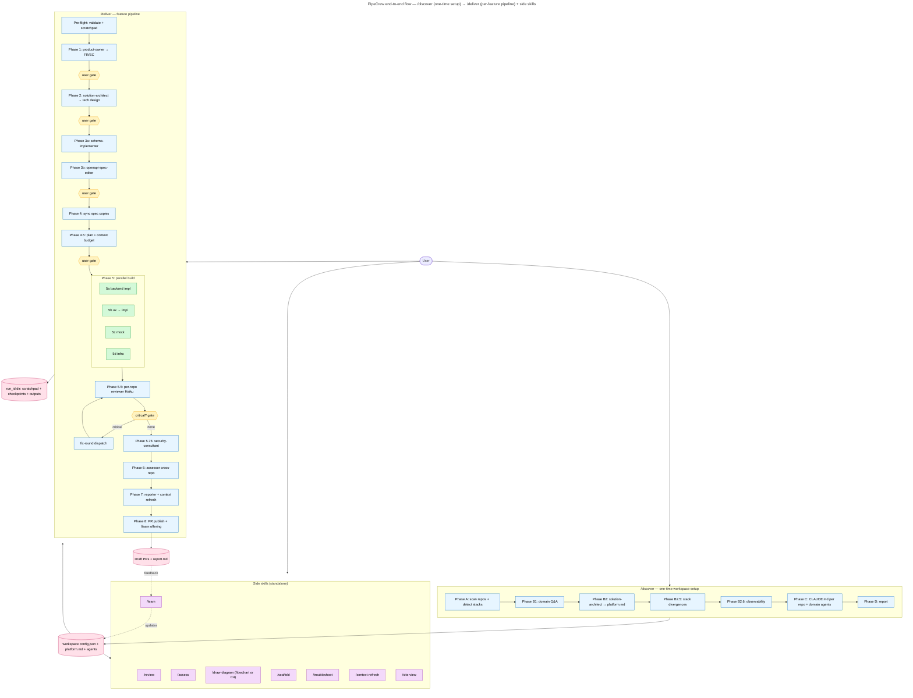

# PipeCrew — Plugin Flow

Two main pipelines, with a feedback loop.

## 1. `/discover` — one-time workspace setup

- **Phase A** — scan parent dirs, detect repos + tech stacks
- **Phase B1** — interrogate domain (questions to user)
- **Phase B2** — `solution-architect` reads code, writes `platform.md`
- **Phase B2.6** — observability extraction (IaC scan)
- **Phase C** — generate `CLAUDE.md` per repo + workspace agents (`{slug}-product-owner`, `{slug}-assessor`, `{slug}-ux-consultant`)
- **Phase D** — final report

Output: `config.json`, `platform.md`, per-repo `CLAUDE.md`, domain agents.

## 2. `/deliver "<feature>"` — feature pipeline

- **Pre-flight** — load config, create scratchpad + run dir
- **Phase 1** — `dal-product-owner` → requirements (FR/EC) → **gate**
- **Phase 2** — `solution-architect` → tech design + AFFECTED_SERVICES → **gate**
- **Phase 3a** — `schema-implementer` (shared contracts: JSON Schema / Avro / Proto)
- **Phase 3b** — `openapi-spec-editor` (per service, ordered) → **gate**
- **Phase 4** — sync spec copies (mock/frontend)
- **Phase 4.5** — implementation plan + context budget → **gate**
- **Phase 5 (parallel)**:
  - **5a** Backend: `spring-boot` / `nestjs` / `fastapi` / `flask` / `django` / `python-worker` (one per service)
  - **5b** Frontend: `ux-consultant` → **gate** → `react-feature-implementer` / `nextjs-implementer`
  - **5c** Mock: `mock-endpoint-implementer`
  - **5d** Infra: `cdk-stack-implementer` / `terraform-implementer`
- **Phase 5.5** — per-repo reviewer (Haiku, `effort: high`) → if critical → **gate** → fix-round
- **Phase 5.75** — `security-consultant` (triggered or `--force-security-review`)
- **Phase 6** — `assessor` (cross-repo verification)
- **Phase 7** — `reporter` + context-manager refresh + archive
- **Phase 8** — PR publish (if `--with-pr`) + `/learn` feedback offering

## 3. Side skills

- `/review` — review changes on the active branch (subset of 5.5)
- `/assess` — cross-repo assessment standalone
- `/learn` — turn PR review / run feedback into durable context updates (with optional fix-round)
- `/draw-diagram` — flowchart **or** C4 Context+Container, standalone via `architecture-mapper` (Tier A→D scan)
- `/scaffold`, `/troubleshoot`, `/context-refresh`, `/simulate-run`, `/site-view`

---

## Capabilities

- **Multi-repo, multi-stack**: Spring Boot, NestJS, FastAPI, Flask, Django, Python workers, React, Next.js, Express mock, CDK, Terraform
- **Worktree isolation** per repo per phase (default ON)
- **Parallel agent dispatch** in Phase 5 / 5.5
- **API-first or code-first** spec policy per service
- **Approval gates** at phase boundaries (driven by `gate.js` → site-view UI)
- **Resumable** via scratchpad (`--resume`, `--from-deferred`)
- **Auto-detection** of phases from config (no hardcoding)
- **Eval harness** (`eval/`) with template-shape + script unit tests
- **Live UI** (`site-view`) — pipeline-view drawer with live diagrams
- **C4 + flowchart** diagram modes via conditional rules-file load

---

## Context-engineering / LLM-attention concepts

| Concept | Where it shows up |
|---|---|
| **Attention-first (signal vs noise)** | Phase files lazy-loaded — only active phase in working memory |
| **U-shape / lost-in-the-middle** | CRITICAL blocks at top; one-line phase-done suffix anchors recency |
| **Structured-block extraction** | JSON-in-markdown via `extract-block.js` — consumers parse, never LLM |
| **Conditional context loading** | `c4-diagram-rules.md` *vs* `discovery-diagram-rules.md` — load one, not both |
| **Hard rules R0–R9** | Implementer-common-rules — cited explicitly in each agent |
| **Effort tuning** | `effort: high` for reviewers/architect; default for mechanical agents |
| **Model tiering** | Reviewers on Haiku 4.5; architect/security on Opus |
| **Scratchpad as source-of-truth** | Conversation history is fragile — files persist |
| **Confidence-tagged edges** | `architecture-mapper` emits high/medium/low — LLM can't bluff |
| **Tier A→D scanning** | identity → declared integrations → grep → verification reads (cheapest first) |
| **Per-run isolation** | `run_id` dirs prevent cross-run context pollution |
| **Context hygiene rule** | Phase 6 reads scratchpad files, not Phase 1/2 chat history |
| **Templates ship examples, not schemas** | Examples carry shape + intent in one artifact |
| **Subagent boundary** | Each agent gets a clean context window — parent doesn't leak phase state in |

---

## What we added to the agents themselves

The above are plugin-wide patterns. The list below is the concrete set of changes baked into the **solution-architect**, **reviewers**, and **implementer** agents in the recent refactor — these are what the agents now *do differently* compared to a naive prompt.

### Solution-architect (`agents/solution-architect.md`)

| Addition | Why it matters |
|---|---|
| `effort: high` in YAML frontmatter | Architect reasoning is the highest-leverage step in the pipeline — one wrong AFFECTED_SERVICES entry breaks all downstream phases. Worth the extra reasoning budget. |
| **"Identify ALL affected services and contracts"** rule (explicit walk of every repo) | The user does NOT pre-select services. Architect must enumerate every repo in `config.json` and judge inclusion. Missing one means no worktree, no implementer, no reviewer for that repo. |
| **JSON-block-first structured outputs** — `AFFECTED_SERVICES`, `API_DESIGN`, `DATA_MODEL`, `INFRASTRUCTURE_IMPACT`, `CONTRACT_DESIGN` | Downstream consumers (`extract-block.js`) parse JSON deterministically instead of re-reading prose. Prose section follows for nuance, but the navigable index is machine-readable. |
| **`spec_policy` per service**: `api-first` / `code-first` / `no-api` | Pipeline uses this to pick the right Phase 3 sub-flow (spec edit vs no-op vs event-schema edit). Architect has to be explicit. |
| **Two modes**: discovery vs design | Discovery mode reads code + writes platform.md; design mode reads platform.md + writes tech design. Same agent, two prompts — keeps the discovery-only file references out of design-mode context. |
| **Conditional diagram rules-file load** (flowchart xor C4) | Architect reads `discovery-diagram-rules.md` *or* `c4-diagram-rules.md` based on caller flag — never both. |
| **Spec gap analysis section** (CRITICAL) | Forces architect to flag spec drift explicitly before designing on top of it. |
| **Breaking-change authorization gate** | Contract changes require explicit "BREAKING — authorized" annotation. Default refuses breaking changes. |

### Reviewers (`spring-boot-`, `react-`, `nestjs-`, `nextjs-code-reviewer.md`)

| Addition | Why it matters |
|---|---|
| `model: haiku` | Reviewer work is verification (spec ↔ diff) — Haiku 4.5 is fast/cheap and accurate enough. Saves Opus budget for architect + security. |
| `effort: high` | Verification still needs deep reading of diffs against spec — high effort, small model. |
| **`## Invariants` section** (added to nestjs/nextjs which lacked it) | Each reviewer cites stack-specific invariants explicitly so the reviewer doesn't have to re-derive them. |
| **Trimmed redundant "Things that will bite you" bullets** | Removed duplication with Invariants — each rule lives in exactly one place (no two-source confusion). |
| **`mechanical` vs `architectural` tagging on every Critical finding** | Drives the `--auto-fix-mechanical` gate skip in Phase 5.5. Reviewer doesn't just say "critical" — says *what kind* of critical. |

### Security consultant (`agents/security-consultant.md`)

| Addition | Why it matters |
|---|---|
| `effort: high` | Security review needs to reason about adversarial input + data flow paths — single-pass surface scans miss the interesting bugs. |

### Implementers (all 11: `spring-boot-`, `nestjs-`, `fastapi-`, `flask-`, `django-`, `python-worker-`, `react-`, `nextjs-`, `mock-endpoint-`, `cdk-stack-`, `terraform-implementer.md`)

| Addition | Why it matters |
|---|---|
| **R0–R9 hard rules cited literally** (was R0–R8 — added R9) | Each agent prompt names the rule by number. R9 = "verify requirement coverage before reporting done" — the missing one that let implementers skip FR/EC checks. |
| **R0**: task file is the source of truth | Agent reads its task file first; never trusts dispatch-prompt prose alone. |
| **R5**: documentation updates are part of done | CLAUDE.md / agent-context updates ship with the code change, not later. |
| **R6**: scope discipline | No incidental refactors. Three similar lines beats premature abstraction. |
| **R7**: state assumptions before coding | Forces a `## Assumptions` section in the task file — reviewer/user can challenge them before the diff lands. |
| **R8**: stay in your launched worktree | Implementer never edits the main checkout — eliminates "wrong branch" footguns. |
| **R9**: verify requirement coverage | Final step is mapping every FR-X / EC-X to the file/line that satisfies it. Empty mapping = not done. |

### NEW: `architecture-mapper` agent

Built standalone (not in `/discover`) so `/draw-diagram` can run on a fresh repo set.

| Addition | Why it matters |
|---|---|
| **8 HARD RULES** ("What to never do") | No fabrication, no inferring edges from naming alone, no glossing confidence, no merging unrelated services. |
| **4-tier scan strategy** (A → D) | A: identity from manifests. B: declared integrations (config files, OpenAPI specs, IaC). C: code grep for HTTP/queue clients. D: verification reads — only on contested edges. Cheapest tier first; stop when confidence is sufficient. |
| **Confidence-tagged edges** (`high` / `medium` / `low`) | Forces the mapper to grade itself. `high` = found in two independent sources; `medium` = one source; `low` = inferred and worth verification. Downstream agent or human can filter. |
| **Conditional output** (flowchart `.mmd` xor C4 `.mmd`) | Single agent, two output formats, one rules-file loaded per run. |

---

## Simplification principles (Karpathy-flavor)

The plugin treats the context window as a **scarce, attention-weighted resource** — every token competes with every other token for the model's focus. The same instinct Karpathy applies to neural-net design (delete what you don't need, keep the simplest thing that works) shows up here as concrete plumbing.

| Principle | How it shows up in PipeCrew |
|---|---|
| **Context window as RAM, not disk** | Phase files lazy-loaded one at a time; orchestrator drops them on phase exit (auto-compaction). The active phase file is the only "code" in working memory. |
| **Tokens are precious — don't dump, distill** | Architect outputs structured JSON blocks (`API_DESIGN`, `DATA_MODEL`); downstream consumers parse with `extract-block.js` instead of re-reading prose. One source-of-truth, many cheap reads. |
| **Brief the LLM like a smart intern who just walked in** | Every agent prompt is self-contained: feature summary + requirements + endpoints + spec paths. No reliance on parent-conversation memory. |
| **Delete the scaffolding that doesn't carry weight** | Reviewer agents on Haiku 4.5 (not Opus); mechanical implementers on Sonnet (not Opus). Effort tuning (`effort: high`) reserved for tasks where deeper reasoning actually changes the answer. |
| **One thing at a time** | Conditional rules-file loading: `c4-diagram-rules.md` **xor** `discovery-diagram-rules.md` — never both. Loading the wrong one is cheaper than loading both. |
| **Compress before prompt, don't ask the model to compress** | `extract-block.js`, `validate-config.js`, `gate.js` — zero-dep Node scripts handle deterministic work. Don't pay LLM tokens for work `JSON.parse` does for free. |
| **Files outlive sessions; conversations don't** | Scratchpad + checkpoints.jsonl are the durable memory. Conversation history is treated as ephemeral cache. |
| **Bias toward fewer, sharper rules** | R0–R9 hard rules cited literally in every implementer agent. Not "follow best practices" — specific, numbered, enforceable. |
| **Cheapest scan first** | `architecture-mapper` Tier A → D: identity → declared integrations → grep → verification reads. Stop at the cheapest tier that gives you confidence. |
| **A diagram with 30 boxes is a failed diagram** | Overview diagram capped at ~10 nodes. The constraint forces the "what is this system actually" question. |
| **Make the LLM emit confidence, not just claims** | `architecture-mapper` tags edges high/medium/low. Forcing the model to grade itself reduces hallucination — it can't bluff a confidence label. |
| **Resumable > monolithic** | Run dirs + scratchpad let `/deliver --resume` pick up at the failed phase. No re-running 30 minutes of work to retry one agent. |

The throughline: **the bottleneck is attention, not capability.** A larger model on a noisier prompt loses to a smaller model on a sharper prompt. Every design decision in the plugin pays attention to that asymmetry.

---

## Diagram

