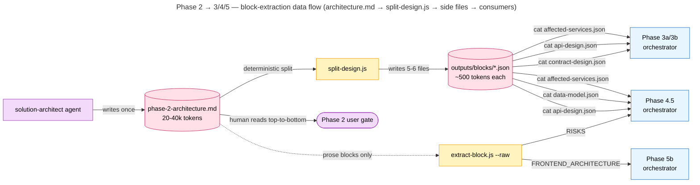
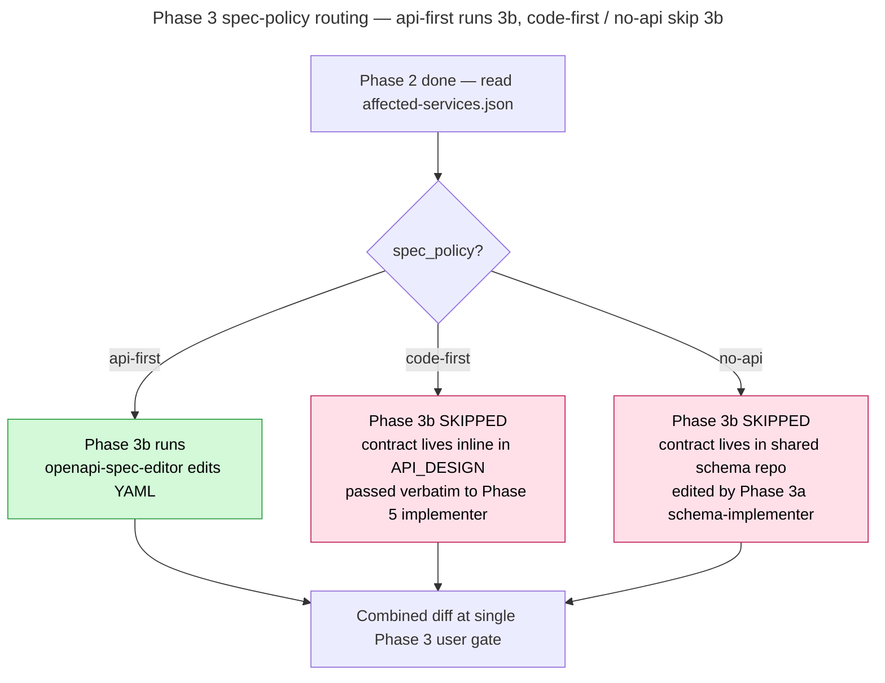
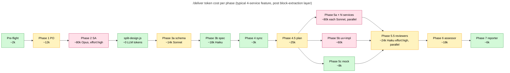

# PipeCrew — Detailed Plugin Flow

Companion to `plugin-flow.md`. The high-level doc shows phases and gates; this one shows the plumbing: how data moves between phases, what the utility scripts do, how the orchestrator avoids loading the wrong things into context.

---

## 1. Run directory anatomy

Every `/deliver` invocation gets its own dir. Same skeleton for every workspace.

```
{workspace_root}/{workspace-slug}/
├── config.json                          ← workspace config (from /discover)
├── context/                             ← active context (agents read every dispatch)
│   ├── platform.md                      ← architecture context, read by SA in design mode
│   ├── audit-findings.md                ← real bugs spotted at onboarding
│   ├── diagrams/                        ← workspace architecture diagrams
│   │   ├── architecture.mmd             ← detailed Mermaid diagram
│   │   ├── architecture-overview.mmd    ← 4-subgraph overview
│   │   └── {topic}.mmd                  ← optional focused diagrams from /draw-diagram --topic
│   └── adrs/                            ← architecture decision records (filled by /deliver Phase 2 ADR gate)
│       ├── INDEX.md                     ← one-line-per-ADR index, read by SA in Step 0
│       └── ADR-NNN-<slug>.md            ← one file per ADR
├── history/                             ← durable workspace history (not auto-loaded)
│   └── learn-log.md                     ← appended by /learn
├── agents/                              ← workspace-specific agents (published to ~/.claude/agents)
│   ├── {slug}-product-owner.md
│   ├── {slug}-assessor.md
│   └── {slug}-ux-consultant.md
├── agent-memory/
│   └── solution-architect/              ← rare architect-private notes (thin)
└── runs/
    ├── discover/{run_id}/               ← /discover invocations
    ├── deliver/{run_id}/                ← /deliver invocations  ← THIS doc focuses here
    └── learn/{run_id}/                  ← /learn invocations

{workspace_root}/{slug}/runs/deliver/{run_id}/
├── scratchpad.md           lean phase-status index (the resume contract)
├── checkpoints.jsonl       append-only event log (observability spec)
├── outputs/
│   ├── phase-1-requirements.md      ← human-readable narrative
│   ├── phase-2-architecture.md      ← human-readable narrative + JSON-fenced blocks
│   └── blocks/                      ← side files materialized by split-design.js
│       ├── affected-services.json
│       ├── affected-contracts.json
│       ├── api-design.json
│       ├── contract-design.json
│       ├── data-model.json
│       └── infrastructure-impact.json
├── tasks/                  per-task .md files (Phase 4.5 → consumed by Phase 5)
├── review/                 per-repo code-review reports (Phase 5.5)
├── security-review.md      (Phase 5.75, optional)
├── assessment.md           Phase 6 cross-repo verification
├── fix-rounds/             per fix-round artifacts (Phase 5.5 follow-ups)
└── report.md               Phase 7 final execution report
```

**`run_id` format**: `{YYYY-MM-DD-HHMMSS}-{feature-slug}`. Computed once at pre-flight. Same-second collision → suffix `-2`, `-3`. Directory listings stay chronologically sortable by name.

---

## 2. The block-extraction layer

### Why it exists

Architect output is verbose: prose sections per service, design rationale, risks, trade-offs. Often 20-40k tokens. The orchestrator only needs the structured pieces (which services to dispatch to, which schemas to edit, what spec_policy each service uses).

Loading the entire markdown into context burns attention on prose the orchestrator never uses — and worse, pollutes context for the next phase decision.

### How it works

Each structured block lives between HTML-comment markers in the architect's markdown:

```markdown
<!-- BEGIN AFFECTED_SERVICES -->
```json
{
  "services": [
    { "name": "publisher-svc", "spec_policy": "api-first",
      "endpoints_added": [{"method":"POST","path":"/v1/books"}],
      "fr_ids": ["FR-1","FR-2"], "ec_ids": ["EC-1"] }
  ],
  "spec_edit_order": ["publisher-svc"],
  "frontend_required": true,
  "mock_required": true
}
\`\`\`

Some prose explaining the choice (this is for human readers at the
Phase 2 gate — orchestrator never reads this part).
<!-- END AFFECTED_SERVICES -->
```

Two zero-dep Node scripts handle extraction.

### `scripts/extract-block.js`

Pulls a single block from a markdown file. Two modes.

| Mode | Command | Returns |
|---|---|---|
| JSON (default) | `node extract-block.js <file> <BLOCK>` | The parsed JSON inside the `\`\`\`json` fence (compact single-line) |
| Raw | `node extract-block.js <file> <BLOCK> --raw` | The block body verbatim — for prose-only blocks (FRONTEND_ARCHITECTURE, RISKS) |

**Exit codes:**
- `0` — block found, output emitted
- `1` — file unreadable
- `2` — usage error or BEGIN/END markers absent
- `3` — no `\`\`\`json` fence inside block (JSON mode only — `--raw` exits 0)
- `4` — JSON parse error

Used by Phase 4.5 for prose blocks the orchestrator can't materialize as side files (FRONTEND_ARCHITECTURE, RISKS, ARCHITECTURE_DECISION).

### `scripts/split-design.js`

Run **once** by Phase 2 right after the architect writes its markdown. Scans every `<!-- BEGIN X -->` block and materializes each `\`\`\`json` fence as a side file under `outputs/blocks/<slug>.json` (lowercase + dashed). Prose-only blocks are skipped silently.

```bash
node {plugin_dir}/scripts/split-design.js {pipeline_dir}/outputs/phase-2-architecture.md
```

| Exit code | Meaning |
|---|---|
| 0 | Success — summary JSON on stdout (`written`, `skipped_prose_only`) |
| 1 | Input unreadable |
| 2 | Usage error |
| 3 | JSON parse error in any block — **halts the pipeline** (architect emitted malformed JSON, must be fixed) |
| 4 | Output dir not writable |

**Idempotent.** Running twice produces identical files. Resume-safe.

### Why not have the architect write the side files directly?

Considered, rejected:
- Architect would do N writes instead of 1 — partial-failure surface.
- Reviewer at the Phase 2 gate wants ONE file to read top-to-bottom.
- The script-side split is deterministic and trivially testable (`split-design.test.js` — 7 unit tests).

### Data flow



The orchestrator never `Read`s the markdown. The human still sees one coherent document at the gate.

---

## 3. Utility script catalog

All zero-dep Node, run via Bash, output to stdout.

| Script | Purpose | Used by |
|---|---|---|
| `extract-block.js <file> <BLOCK> [--raw]` | Pull one block from markdown | Phase 4.5 (prose blocks), legacy callers |
| `split-design.js <file> [out-dir]` | Materialize all JSON blocks as side files | Phase 2 (after architect writes) |
| `gate.js {open\|close} --run-dir=… --phase=N --gate=approval --question="…"` | Open/close approval gates → drives site-view UI banner + browser tab `⏸` prefix | Every phase with a user gate (1, 2, 3, 4.5, 5b, 5.5) |
| `validate-config.js <path>` | Validate workspace `config.json` shape | Pre-flight |
| `validate-claude-md.js <path>` | Lint a `CLAUDE.md` against guardrails | After context-manager runs |
| `validate-checkpoints.js <path>` | Validate `checkpoints.jsonl` event format | CI / debugging |
| `workspace-root.js --get` | Resolve workspace root path (per-machine config) | Pre-flight |
| `simulate-run.js [--no-ui] [--port=…]` | Generate demo workspace + spawn site-view | UI testing, demos |
| `extract-observability.js <iac-dir>` | Scan CDK / Terraform / k8s / docker-compose for observability config | `/discover` Phase B2.6 |

**Why scripts and not LLM calls?**
- Deterministic — same input, same output. No retry loops.
- Cheap — each call is ~100ms vs ~5s for a model call.
- Testable — `extract-block.test.js` and `split-design.test.js` cover edge cases that would otherwise show up as production bugs.
- Auditable — exit codes are documented; failures don't hide.

---

## 4. The structured-block contract

Every JSON block has:
1. A canonical example at `templates/blocks/<slug>.example.json`
2. A schema-shape check in `eval/tests/01-templates-parse.js`
3. A consumer list documented in `templates/blocks/block-schemas.md`

| Block | Producer | Consumers |
|---|---|---|
| `REQUIREMENTS_INDEX` | product-owner (Phase 1) | architect (Phase 2), assessor (Phase 6) |
| `AFFECTED_SERVICES` | architect (Phase 2) | Phase 3 (filter `spec_policy === "api-first"`), Phase 4.5 (per-service task generation), Phase 5 (dispatch loop) |
| `AFFECTED_CONTRACTS` | architect (Phase 2) | Phase 3a (schema-implementer dispatch) |
| `CONTRACT_DESIGN` | architect (Phase 2) | Phase 3a (schema-implementer prompt body) |
| `API_DESIGN` | architect (Phase 2) | Phase 3b (openapi-spec-editor prompt body), Phase 4.5 (mock + frontend tasks), Phase 5b (UX consultant) |
| `DATA_MODEL` | architect (Phase 2) | Phase 4.5 (backend tasks), Phase 5a (implementer task body) |
| `INFRASTRUCTURE_IMPACT` | architect (Phase 2) | Phase 5d (terraform/cdk implementer) |
| `MAPPER_REPORT` | architecture-mapper (`/draw-diagram`) | site-view UI, `/discover` Phase B2 |
| `COVERAGE` | implementer R9 step (Phase 5) | Phase 6 (assessor verification) |
| `FINDINGS_SUMMARY` | reviewers (Phase 5.5) | Phase 5.5 gate logic (`--auto-fix-mechanical` decision) |
| `OBSERVABILITY` | `extract-observability.js` (`/discover` Phase B2.6) | platform.md, site-view |

---

## 5. Spec-policy routing (how Phase 3 actually decides)

Per-service `spec_policy` set by architect in `AFFECTED_SERVICES`:



A single feature can mix all three:
- `code-first` FastAPI service (no spec edit) +
- publishes `BookPublishedEvent` (Avro schema in contract repo, edited 3a) +
- consumed by `no-api` worker (no spec at all) +
- `api-first` Spring Boot service (spec edited 3b)

Phase 3 handles all four with one combined diff and one gate.

---

## 6. Worktree policy

**Default ON.** Each repo touched gets a worktree at sibling path on branch `feature/{feature-slug}`.

| Phase | Worktree action |
|---|---|
| 3a | Creates worktrees for repos in `AFFECTED_CONTRACTS`. Records `contract_worktrees: {repo → path}` in scratchpad. |
| 3b | Creates worktrees for `api-first` services not already covered by 3a. Records `spec_worktrees`. |
| 5 | Reuses worktrees from 3a/3b. Creates new ones for backend/frontend/infra repos not covered yet. |
| 5.5 | Reads diffs from the same worktrees. No worktree creation. |

**Rollback** is the orchestrator's job, not the agent's. On Phase 3 reject:
```bash
cd {worktree_path} && git checkout {file}
```
Worktrees stay (Phase 5 might still need them); user explicitly opts in to delete via:
```bash
git worktree remove ../{repo}-{slug} && git branch -D feature/{slug}
```

`--no-worktrees` opts out entirely — agents work in-place on the current branch. Use only for small interactive fixes.

---

## 7. Agent dispatch protocol

The orchestrator never calls `claude -p`. All sub-agents launch via the `Agent` tool in-session.

### Agent type → name resolution

```
TYPE_TO_AGENT (from phases/dispatch-rules.md):
  api-service.spring-boot   → spring-boot-api-implementer
  api-service.nestjs         → nestjs-implementer
  api-service.fastapi        → fastapi-implementer
  api-service.flask          → flask-implementer
  api-service.django         → django-implementer
  worker.python              → python-worker-implementer
  frontend.react             → react-feature-implementer
  frontend.nextjs            → nextjs-implementer
  mock-server                → mock-endpoint-implementer
  infrastructure.cdk         → cdk-stack-implementer
  infrastructure.terraform   → terraform-implementer
  contract                   → schema-implementer
```

Workspace-specific agents resolve by slug-prefix: `{slug}-product-owner`, `{slug}-ux-consultant`, `{slug}-assessor`. Published to `~/.claude/agents/` by `/discover` Phase C Step 3. **Fallback** if not found: `general-purpose` with a preamble that reads the canonical copy at `{workspace_root}/{slug}/agents/{role}.md`.

### Task file contract (Phase 4.5 → Phase 5)

The orchestrator writes one `.md` task file per implementer dispatch. Each task is self-contained — implementer reads ONLY its own task file, never the architect's full output.

Frontmatter schema:
```yaml
---
id: {feature-slug}-{6char-suffix}
agent: spring-boot-api-implementer
repo: publisher-svc
worktree: /abs/path/publisher-svc-bulk-upload
spec_policy: api-first
fr_ids: [FR-1, FR-2]
ec_ids: [EC-1]
status: PENDING | IN_PROGRESS | COMPLETED | FAILED | DEFERRED
---
```

Body has fixed sections: `## Feature Summary`, `## Requirements`, `## Spec Excerpt`, `## Data Model Excerpt`, `## Known Pitfalls`, `## Acceptance Criteria`. Each section is the relevant slice of architect output, NOT the full design.

### Parallel execution

Phase 5a (backend), 5b (frontend), 5c (mock), 5d (infra) — dispatched in a **single message with multiple Agent tool calls** so they run in parallel. Each is its own context window; the orchestrator collects results and proceeds to 5.5.

Within 5a, multiple services dispatch in parallel too (one Agent call per affected service).

---

## 8. The scratchpad — single source of truth for resume

`{run_dir}/scratchpad.md`. Lean by design — every phase appends a status row, never re-renders the whole pipeline.

```markdown
## Pipeline Status

| Phase | Status | Started | Finished | Output |
|---|---|---|---|---|
| Pre-flight | COMPLETED | 10:00:01 | 10:00:04 | scratchpad.md created |
| 1. Requirements | COMPLETED | 10:00:04 | 10:02:18 | outputs/phase-1-requirements.md |
| 2. Architecture | COMPLETED | 10:02:18 | 10:08:42 | outputs/phase-2-architecture.md + outputs/blocks/ |
| 3a. Contract Edit | COMPLETED | 10:08:42 | 10:11:06 | scratchpad.md "Contract diffs" |
| 3b. Spec Edit | COMPLETED | 10:11:06 | 10:14:33 | scratchpad.md "Spec diffs" |
| 4. Sync Specs | COMPLETED | 10:14:33 | 10:14:48 | — |
| 4.5. Plan | COMPLETED | 10:14:48 | 10:18:20 | tasks/*.md |
| 5a. Backend (publisher-svc) | IN_PROGRESS | 10:18:21 | — | tasks/{id}.md |
| 5a. Backend (search-svc) | COMPLETED | 10:18:21 | 10:25:12 | tasks/{id}.md |
| ... |

## Architecture Flags
- frontend_required: true
- mock_required: true
- contracts_required: true
- contract_worktrees: { contracts-shared: /abs/path/contracts-shared-bulk-upload }
- spec_worktrees: { publisher-svc: /abs/..., search-svc: /abs/... }

## Agent Dispatch Log
| Phase | Agent | Task ID | Outcome | Duration | Tokens |
|---|---|---|---|---|---|
| 2 | solution-architect | — | success | 6m24s | 78,400 |
| 3a | schema-implementer | — | success | 2m24s | 14,200 |
| 3b | openapi-spec-editor | — | success | 3m27s | 18,900 |
| ...|
```

**Resume mechanics:**
- `/deliver --resume` reads scratchpad, finds first non-`COMPLETED` row, picks up there.
- Status values are *literal* — only `COMPLETED` / `IN_PROGRESS` / `FAILED` parse correctly. (Per project memory: stale rows look queued in the UI.)
- `--from-deferred=<feature-slug>` is different — starts a NEW run from `deferred/<feature-slug>.md` (a follow-up file the architect wrote at a "Minimum only" gate in a previous run).

---

## 9. Observability — `checkpoints.jsonl`

Append-only event log per run. One JSON object per line. Authoritative spec: `docs/observability.md`.

Common fields on every event: `ts` (ISO8601 UTC), `event`, `skill`, `run_id`. Phase events also have `phase`, `stage`.

| `event` | Emitted when | Payload |
|---|---|---|
| `run_start` | Pre-flight start | `feature_summary`, `flags` |
| `phase_start` | Phase begins | `phase`, `stage` |
| `phase_end` | Phase finishes | `phase`, `stage`, `outcome` |
| `agent_start` | Sub-agent dispatched | `agent_type`, `task_id` |
| `agent_end` | Sub-agent returned | `total_tokens`, `duration_ms`, `outcome` |
| `gate_open` | User approval gate opened | `phase`, `question` |
| `gate_close` | User answered | `phase`, `decision` |
| `retry` | Transient failure retry | `attempt`, `reason` |
| `run_end` | Run finished | `outcome` |

Used by:
- `pipecrew:reporter` — generates the Phase 7 execution report (waterfall timeline, per-agent token breakdown, daily budget status, narrative insights).
- `site-view` — `fs.watch` triggers SSE broadcast on append; pipeline-view animates in real time.
- `validate-checkpoints.js` — CI lint (25 unit tests).

---

## 10. Gates — the user-approval contract

Six approval gates in `/deliver`. Each one has the same protocol.

```bash
# Before asking the user:
node {plugin}/scripts/gate.js open --run-dir={run_dir} --phase={N} --gate=approval --question="..." [--context="..."]

# (orchestrator asks user, waits for response)

# After user answers:
node {plugin}/scripts/gate.js close --run-dir={run_dir}
```

The `gate open`/`close` writes to `gate.json` in the run dir. Site-view's pipeline-view watches it and:
- Shows the yellow "waiting for input" banner.
- Prefixes the browser tab with `⏸`.
- Surfaces the question + context in the drawer.

**Forgetting to `close` after the user answers** leaves the banner stuck. Treat open/close as mandatory bracketing.

| Phase | Gate question | Auto-skip condition |
|---|---|---|
| 1 | "Approve requirements?" | — |
| 2 | "Approve technical design?" | — |
| 3 | "Approve contract + spec changes?" | `--skip-spec-edit` |
| 4.5 | "Approve implementation plan?" | — |
| 5b UX | "Approve UX spec before implementation?" | `--frontend-only` skips Phase 5b entirely |
| 5.5 | "Critical findings — dispatch fix round?" | `--auto-fix-mechanical` AND every critical is tagged `mechanical` |

---

## 11. Auto-detection — phases derive from config, not assumptions

After loading `config.json`, the orchestrator walks the repo list and decides which phases run. **Flags override auto-detection, not the other way around.**

| Phase | Auto-runs if | Override |
|---|---|---|
| 3a | `AFFECTED_CONTRACTS` non-empty | `--skip-spec-edit` |
| 3b | any affected service has `spec_policy: api-first` | `--skip-spec-edit` |
| 4 | any repo has `spec_copies` in config | — |
| 5a | config has repos with `role: api-service` | `--frontend-only` |
| 5b | config has repos with `role: frontend` | `--backend-only` |
| 5c | config has repos with `role: mock-server` | `--no-mock` |
| 5d | config has repos with `role: infrastructure` AND architect flagged | `--with-infra` forces |
| 5.5 | any Phase 5 task ran | `--no-review` |
| 5.75 | keyword trigger or `--force-security-review` | `--no-security` |
| 6 | **2+** repos modified in Phase 5 (single-repo skipped — reviewer covers it) | — |
| 7 | always | — |
| 8 | always Step 8.6 (feedback offering); PR publish only with `--with-pr` AND no Phase 6 blockers | — |

Logged on entry: `"Auto-detected phases: {list}. Skipped: {list with reasons}."`

---

## 12. Failure handling

### Transient failures (529, 503, network)

Per `docs/transient-failures.md`:
- Retry once on 529/503/network. Wait per `retry-after` on 429.
- Halt on a second 429 or any non-429 4xx.
- Emit `retry` then `agent_end` events.
- On parallel dispatch, retry only the failed agent — let the rest finish.
- Deferred agents block advancing to the next gating phase until user resumes.

### Hard failures (400, parse errors, validation)

- `split-design.js` exit 3 (malformed JSON in architect output) → halt, surface raw error to user, dispatch architect again with the parse error in the prompt.
- `openapi-spec-editor` YAML validation failure → stop before next service; orchestrator decides whether to fix or revert.
- Implementer R9 step finds an unsatisfied FR/EC → task marked FAILED, surfaced at Phase 5.5.

### Resume after context limit

Scratchpad persists. User runs `/deliver --resume` in a new session. Orchestrator reads scratchpad, finds first non-`COMPLETED` row, continues. No work lost.

---

## 13. The eval harness

`eval/run.js` runs four layers. Run before any plugin change.

| Layer | What it tests | File |
|---|---|---|
| L1 | Every `templates/blocks/*.example.json` parses + matches its documented shape | `01-templates-parse.js` |
| L2 | Co-located unit tests for utility scripts (extract-block, split-design, validate-checkpoints, validate-claude-md, troubleshooter, extract-observability) | `04-co-located-tests.js` |
| L3 | Cross-references — every `templates/blocks/*` is referenced from at least one consumer, no orphan templates | (in L1) |
| L4 (deferred) | LLM-as-judge for prose outputs (architect quality, reviewer quality) | `llm-judge/` |

Current: 4/4 test files passing, ~150+ individual assertions. Adding a script means adding `<script>.test.js` next to it — `04-co-located-tests.js` auto-discovers.

---

## 14. End-to-end token-cost diagram

Approximate per-phase token cost on a typical 4-service feature with the new block-extraction layer:



**Where the savings landed:**
- Phase 3a, 3b, 4.5, 5b orchestrator overhead dropped from `Read entire architecture.md` (~30k each load) to `cat one side file` (~500-2000 tokens each load). At 4 phases × 30k = 120k reclaimed, all of which would have been inattentive bytes the orchestrator would have skimmed past anyway.
- Reviewer model swap (Opus → Haiku 4.5) on Phase 5.5 cuts that phase's cost ~5×.
- Architect stays on Opus + `effort: high` because it's the highest-leverage step.

---

## See also

- `plugin-flow.md` — high-level pipeline overview
- `attention-and-caching.md` — the rationale for treating attention as the bottleneck
- `attention-remaining.md` — what's still deferred from the original work plan
- `pipecrew-vs-agent-teams.md` — comparison with Claude Code's native Agent Teams
- `standalone-usage.md` — using individual skills/agents outside `/deliver`
- `templates/blocks/block-schemas.md` — the canonical schema for every JSON block
- `docs/observability.md` — `checkpoints.jsonl` event spec
- `docs/transient-failures.md` — retry / halt rules
- `docs/site-view.md` — gate contract + label catalog
