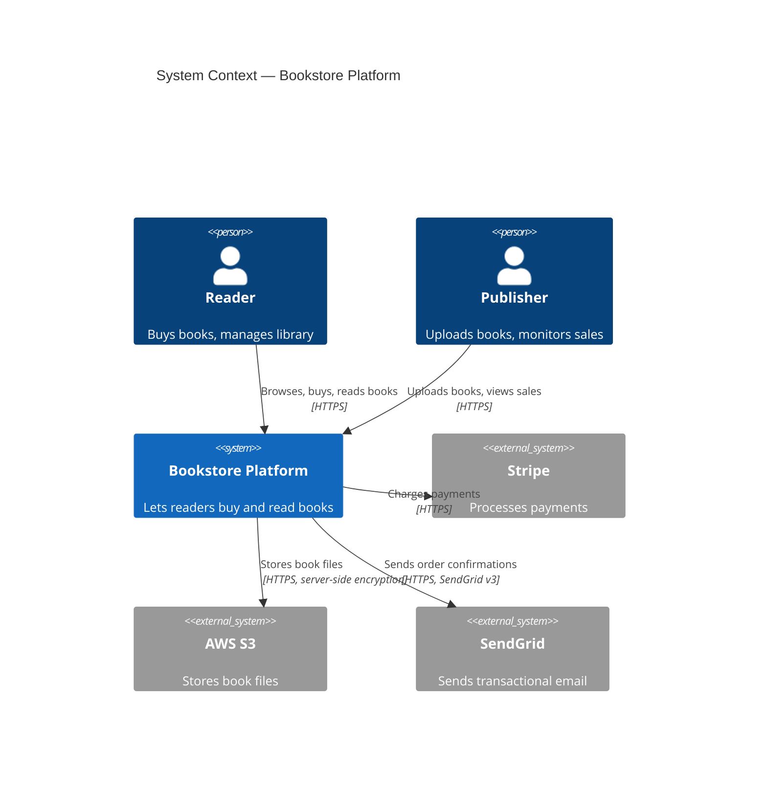
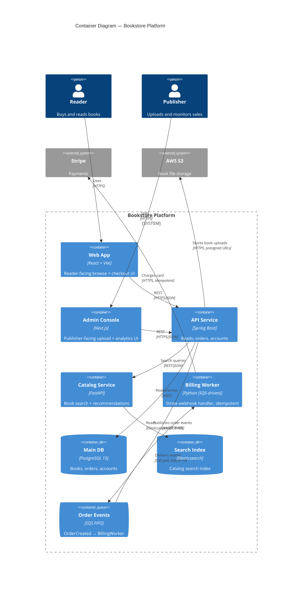

# C4 Diagram Rules

**Load this file when the dispatch requests `--c4` mode** (either `/draw-diagram --c4` or `/discover` with C4 enabled). The agent reads this file *instead of* `discovery-diagram-rules.md` for that run. Do not load both — they describe different output formats.

The C4 model (Simon Brown) defines four levels of architectural abstraction. PipeCrew's `/draw-diagram --c4` produces two diagrams by default — the levels most useful at workspace scale:

1. **Context** (`c4-context.mmd`) — the system as a black box, the people who use it, and the external systems it talks to.
2. **Container** (`c4-container.mmd`) — what's inside the system: services, datastores, queues, frontends. Each container is a deployable unit.

Optionally, with `--c4-level=component` or `--c4-level=all`:

3. **Component** (`c4-component-{system}.mmd`) — internals of one chosen system. Produce on demand, not by default — components vary per service and bloat fast.

Code-level (level 4 — class diagrams) is deliberately out of scope for this skill. Architectural overviews don't benefit from code-level diagrams; consumers who want them generate from the source.

Both Context and Container files render live in the site-view's Project drawer via `mermaid.js` (which supports the C4 syntax natively).

---

## Mermaid C4 syntax — what you must use

Mermaid supports C4 via dedicated diagram types. Use these exact keywords; do **not** mix C4 syntax with `flowchart` syntax in the same file.

### Diagram type declarations (line 1 of every file)

| File | Declaration |
|------|-------------|
| `c4-context.mmd` | `C4Context` |
| `c4-container.mmd` | `C4Container` |
| `c4-component-{system}.mmd` | `C4Component` |

### Element types

| Element | When to use | Mermaid syntax |
|---|---|---|
| Person | A user, role, or actor | `Person(alias, "Label", "Description")` |
| Person_Ext | An actor outside your organization | `Person_Ext(alias, "Label", "Description")` |
| System | The system being described (Context level only) | `System(alias, "Label", "Description")` |
| SystemDb | The system, when it's primarily a database | `SystemDb(alias, "Label", "Description")` |
| SystemQueue | The system, when it's primarily a queue | `SystemQueue(alias, "Label", "Description")` |
| System_Ext | An external system (not yours) | `System_Ext(alias, "Label", "Description")` |
| Container | A deployable unit (Container level) | `Container(alias, "Label", "Technology", "Description")` |
| ContainerDb | A datastore | `ContainerDb(alias, "Label", "Technology", "Description")` |
| ContainerQueue | A queue/topic | `ContainerQueue(alias, "Label", "Technology", "Description")` |
| Container_Ext | An external container | `Container_Ext(alias, "Label", "Technology", "Description")` |
| Component | A logical block inside a Container (Component level) | `Component(alias, "Label", "Technology", "Description")` |
| ComponentDb | A datastore at component level | `ComponentDb(alias, "Label", "Technology", "Description")` |

### Relationship types

| Element | When to use |
|---|---|
| `Rel(from, to, "Label", "Technology")` | Default: undirected edge with a label |
| `BiRel(from, to, "Label", "Technology")` | Bidirectional |
| `Rel_Up(from, to, "Label", "Technology")` | Layout hint — draw upward |
| `Rel_Down(from, to, "Label", "Technology")` | Layout hint — draw downward |
| `Rel_Left(from, to, "Label", "Technology")` | Layout hint — draw leftward |
| `Rel_Right(from, to, "Label", "Technology")` | Layout hint — draw rightward |

**Every relationship must have a label.** Unlabeled edges in C4 are noise. Use the verb the actual integration uses: "Reads from", "Publishes to", "Authenticates via", "Calls REST", "Calls gRPC".

The `"Technology"` field is optional but valuable — `"HTTPS/JSON"`, `"AMQP"`, `"async, S3-event"`, `"JDBC"` all add real signal. Include it whenever known.

### Boundaries

| Boundary | When to use |
|---|---|
| `Enterprise_Boundary(alias, "Label") { ... }` | Group everything inside your organization (Context level — useful when external systems matter) |
| `System_Boundary(alias, "Label") { ... }` | Group containers inside one system (Container level) |
| `Container_Boundary(alias, "Label") { ... }` | Group components inside one container (Component level) |

Boundaries are containers themselves — close them with `}`. Nesting is allowed but should be shallow.

---

## Conventions per level

### Level 1: `c4-context.mmd`

**What to INCLUDE:**
- The single primary `System(...)` representing the workspace's product.
- Every distinct user role / actor (`Person(...)` or `Person_Ext(...)`).
- Every external system the product integrates with (`System_Ext(...)`) — payment gateway, identity provider, third-party APIs, partner systems.
- One labeled `Rel(...)` for each interaction, with technology hint.

**What to EXCLUDE:**
- Internal services, queues, databases — those are Container level.
- Implementation details — "REST endpoint /v1/orders" is too low for Context.
- Cardinality (1, N, *) — context is qualitative, not quantitative.

**Aim for 3–8 elements total.** If you have more, you're describing the inside of the system, not its context.

### Level 2: `c4-container.mmd`

**What to INCLUDE:**
- One `Container(...)` per deployable unit: each backend service, frontend app, worker, mock server.
- One `ContainerDb(...)` per database, even if shared across services.
- One `ContainerQueue(...)` per queue/topic — name them after the actual queue.
- The same external systems as Context (now they're connected to specific containers).
- The same actors as Context (now connected to specific containers).
- A `System_Boundary(...)` wrapping all of YOUR containers — makes external systems visually distinct.

**What to EXCLUDE:**
- Internal modules / classes / packages — those are Component level.
- Configuration values, credentials, secrets.
- The Person/System pair from Context unless they're directly interacting with a container.

**Aim for 5–20 elements total.** If you have more containers than that, the workspace probably has too many services or you're describing components.

### Level 3 (optional): `c4-component-{system}.mmd`

Generate **only when explicitly requested** via `--c4-level=component` or `--c4-level=all`. Per-system breakdown of a single Container's internal components.

**What to INCLUDE:**
- One `Component(...)` per logical block inside the chosen container — controllers, services, repositories, gateways.
- One `ComponentDb(...)` for any datastore the components access.
- External `Container_Ext(...)` references for cross-container interactions.

**Aim for 5–15 components.** Beyond that, the container is genuinely too big and should be split or you should pick a sub-area.

---

## Layout directives

C4 diagrams in Mermaid are top-down by default. Override per-relationship with `Rel_Up/Down/Left/Right` for clarity. Don't add a `LAYOUT_LEFT_RIGHT` macro at the top unless the diagram is genuinely wider than tall.

For complex Container diagrams, group related containers visually with `System_Boundary(...)`, even if the boundary is informal ("Backend Services" vs "Frontend Apps" vs "Data Layer").

---

## Naming conventions

| Aspect | Rule | Example |
|---|---|---|
| Alias (variable name) | lowercase, underscore-separated, no hyphens (Mermaid C4 doesn't tolerate hyphens in aliases) | `order_service`, `web_app`, `main_db` |
| Label (display name) | Title Case, human-readable, no abbreviations | `"Order Service"`, `"Web App"`, `"Main DB"` |
| Technology | One short phrase, framework + datastore | `"Spring Boot, JDBC"`, `"React, TanStack Query"` |
| Description | One short sentence, ends with the role it plays | `"Handles checkout flow, talks to Stripe and the order queue"` |
| Queue/topic names | Match the actual queue name | `"order-events"`, `"book-uploaded"` |

---

## Self-check BEFORE returning each diagram

Run through this list. If any answer is "no", fix before emitting:

- [ ] First line is `C4Context` / `C4Container` / `C4Component` (no `flowchart` syntax mixed in).
- [ ] Every alias is lowercase + underscores (no hyphens).
- [ ] Every relationship has a label (no `Rel(a, b)` with empty third arg).
- [ ] Every external system uses `System_Ext` or `Container_Ext` — not `System` or `Container`.
- [ ] Boundaries are properly closed with `}`.
- [ ] No commented-out lines (Mermaid C4 doesn't always handle inline comments cleanly — keep code clean).
- [ ] The diagram has the right element count for its level (Context ≤ 8, Container ≤ 20, Component ≤ 15).
- [ ] Title is set: `title <Diagram Name> — <Workspace>`.

---

## What this file is NOT

- **Not a tutorial.** It assumes the agent knows what C4 levels are. If unclear, default to flowchart mode (`discovery-diagram-rules.md`).
- **Not a substitute for thinking.** C4 syntax can encode anything; the value is at the *abstraction* boundary. A Context diagram with 30 boxes is a failed Context diagram, even if the syntax parses.
- **Not for code-level diagrams.** Class/sequence diagrams are not in scope for this skill. Use Mermaid's `classDiagram` or `sequenceDiagram` directly if needed elsewhere.

---

## See also

- [`discovery-diagram-rules.md`](./discovery-diagram-rules.md) — flowchart-mode conventions (the default)
- The C4 model itself: <https://c4model.com>
- Mermaid C4 docs: <https://mermaid.js.org/syntax/c4.html>
