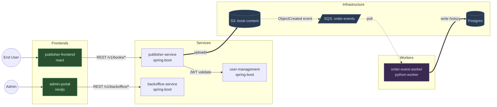

## Phase B: Domain Questions + Architect-Led Discovery

Two parts: minimal human questions (B1), then automated code discovery (B2).

---

### B1: Domain Interrogation (3 questions — name was already captured in Pre-phase 0)

The project name was already collected in Pre-phase 0 (used to create the scratchpad dir). Do NOT re-ask it. Ask only the three remaining questions. The opener should echo the name back for confirmation so the user can catch a typo without another round-trip:

```
Domain details for {workspace.name}. Three quick questions:

1. **Domain in one sentence**: What does it do?
   (e.g., "Arabic-language book publishing and review platform")

2. **User roles**: Who uses it? List the roles.
   (e.g., Publisher, Manager, Reviewer, Admin)

3. **Languages + RTL**: Which UI languages, and is RTL needed?
   (e.g., "English + Arabic, yes RTL" or "English only, no RTL")
```

From these answers + Pre-phase 0 name, derive:
- `workspace.name` = name from Pre-phase 0
- `workspace.slug` = kebab-case of the name (lowercase, non-alphanum → `-`, truncate to 20 chars)
- `domain.name` = same as `workspace.name`
- `domain.domain_notes` = answer 1
- `domain.user_roles` = answer 2 (split by comma)
- `domain.i18n_languages` = answer 3 (parse language codes)
- `domain.rtl_support` = true if RTL mentioned in answer 3

**If the user corrects the name in their answer** (e.g., "Actually it's called X, not Y"), treat that as a name-change request: update the scratchpad, rename the workspace directory if the slug changes, and re-confirm before proceeding.

Do NOT ask about:
- Tech stack — already detected in Phase A
- Entities — architect discovers from code in B2
- API design — not the user's job
- Deployment — discovered from infra repo

**Update scratchpad**: write answers to `## Domain Answers` in `scratchpad.md`. Set Phase B1 status to COMPLETED. Set Current Phase to "B2. Architect Discovery".

---

### B2: Architect-Led Context Discovery

Launch the `solution-architect` agent to read actual code and produce a rich platform context document. This is the heavy-lift step that replaces dozens of human questions with automated discovery.

**Tool**: `Agent`
**subagent_type**: `solution-architect`
**description**: `"Onboard — architect discovery for {workspace.name}"`
**prompt**:

```
MODE: discovery

You are onboarding to a new project: {workspace.name}.
{domain.domain_notes}

This invocation is DISCOVERY MODE — your output is descriptive (what exists in
this system), not prescriptive (what to build). Design-mode invocations happen
later from the /deliver pipeline and read the file you produce here. Do not
propose new architecture, refactors, or technical solutions in this mode.

Your job: read the actual codebases and produce a platform context document.

REPOS TO ANALYZE (read CLAUDE.md if it exists, then explore key files):
{for each repo in the confirmed list:}
- {repo.name} ({repo.type}, {repo.role}) at {repo.path}
  {if repo.spec_file: "Spec: {repo.path}/{repo.spec_file}"}
  {if repo.has_claude_md: "Has CLAUDE.md — read it first"}

DOMAIN CONTEXT FROM USER:
- Name: {domain.name}
- Description: {domain.domain_notes}
- User roles: {domain.user_roles}
- Languages: {domain.i18n_languages}, RTL: {domain.rtl_support}

DISCOVERY TASKS:
1. For each api-service repo: read the OpenAPI spec (or controller files if no spec). List all entities with their key fields and status lifecycles.
2. Identify entity ownership — which service owns which entity.
3. Map integration patterns: sync (REST calls between services), async (events/queues/S3 triggers), shared resources.
4. Read infra repo (if exists) to identify: queue names, bucket names, deployment topology.
5. For frontend repos: identify the component library, design system, routing pattern, state management.
6. Note any established patterns that all agents should follow (naming conventions, error handling patterns, auth mechanism, test patterns).
7. List known constraints or tech debt items visible from the code.

OUTPUT FORMAT:
Produce the platform context document using the section structure from the template below. Fill in every section with what you discovered — leave none blank. If a section has no data (e.g., no infra repo exists), write "Not applicable — no infrastructure repo in the workspace."

The `## Architect Guidance` section is a STUB — leave it with the exact placeholder content specified below. It is meant for the user (or future onboarding passes) to fill in with workspace-specific design heuristics that future design-mode invocations should apply. Do not populate it from your own discovery; it's a human-edited slot.

TEMPLATE SECTIONS:
## Domain
## Architecture Diagram
## Entities & Ownership (table: Entity | Owning Service | Key States)
## User Roles & Permissions (table: Role | Description | Key Permissions)
## Status Lifecycles
## Service Map (table: Service | Repo | Type | Spec | Description)
## Tech Stack
## Integration Patterns
## Infrastructure Topology
## Established Patterns (all agents must know these)
## Known Constraints
## Open Questions / Evolving Decisions
## Architect Guidance

For the `## Architecture Diagram` section in platform.md, write EXACTLY this pointer content:

    The architecture is captured as two complementary diagrams in sibling Mermaid files:

    - [`architecture-overview.mmd`](./architecture-overview.mmd) — **high-level** C4-style
      block diagram for a new team member. ~10 nodes grouped into 4 categories
      (Frontends / Backend services / Queues / Data sources). Read this first.
    - [`architecture.mmd`](./architecture.mmd) — **detailed** topology with every
      service, DB, queue, Lambda, and specific edge labels. Read this when you
      need to know which endpoint / Feign client / bucket is involved.

    Both are rendered live in the site-view "Project" drawer. Edit the `.mmd`
    files directly to update; re-running `/discover` will prompt before
    overwriting a hand-edited file.

You produce **two diagrams** in this phase, with DIFFERENT rules per diagram.

**Read the full rules file FIRST**, before producing either diagram:

```
{plugin_dir}/docs/discovery-diagram-rules.md
```

This file contains: the 4-block taxonomy for the overview, the node shape conventions per category, the classDef palette with exact hex codes, the init directive, the 12-item self-check checklist, the lexical-safety rules, and the detailed-diagram conventions. It is the single source of truth for diagramming. Do not rely on memory or reconstruct from examples — read the file at the start of this phase.

### Diagram 1: `architecture-overview.mmd` (high-level, new-joiner friendly)

Apply the "Mermaid conventions for `architecture-overview.mmd` (high-level)" section of the rules file. Key specifics for this workspace:

- The 4 subgraphs (Frontends / Backend services / Queues / Data sources) — no others.
- Short logical labels (`auth_db` not the full `abvi_auth_db`; `books S3` not the full bucket name).
- Cylinder `[(...)]` for ALL data sources including S3, even if the label is long.
- `-->` sync with one-word label, `-.->` async with one-word label. Every edge labeled.
- Target ~10 nodes, 12-15 edges.
- Start with the init directive line from the rules file.
- **Before returning this file, walk the 12-item Self-check at the end of the rules file.** Every item must pass.

### Diagram 2: `architecture.mmd` (detailed topology)

Apply the "Mermaid conventions for `architecture.mmd` (detailed)" section of the rules file. Specifics:

- **Every service** from the Service Map as a node, grouped in `subgraph` blocks by role (Frontends, Services, Workers, Databases, Infrastructure, External).
- **External actors** (user roles, third-party services) as nodes outside the service subgraphs, drawn at the top.
- **Every edge** comes from the Integration Patterns you captured — label each edge with the endpoint prefix, queue/topic name, or resource name so a reader can audit it against the code.
- Choose `graph LR` by default; switch to `graph TB` only if the topology is clearly top-down.

### Output shape expected from you

Produce BOTH diagrams in your reply, clearly labeled, in this order:

```
<!-- BEGIN architecture-overview.mmd -->
```mermaid
%%{init: ...}%%
graph LR
  ... high-level diagram per overview rules ...
```
<!-- END architecture-overview.mmd -->

<!-- BEGIN architecture.mmd -->
```mermaid
graph LR
  ... detailed diagram per detailed rules ...
```
<!-- END architecture.mmd -->
```

Example skeleton for the **detailed** diagram (illustrates the conventions — do NOT copy literally; produce the real topology from the workspace):



For the `## Architect Guidance` section, write EXACTLY this stub content (replace {workspace.name} with the actual name):

    Workspace-specific heuristics for the architect to apply in DESIGN mode
    (during /deliver pipeline invocations). Leave this stub in place if
    empty — the file still loads cleanly.

    Examples of the kind of guidance that belongs here (do NOT write these
    unless they're real for {workspace.name} — this is a template):

    - For any status-transition work, prefer extending the existing workflow
      orchestrator over adding a new service-layer state machine.
    - Cross-service writes go through the established async pattern; never
      introduce new synchronous cross-service DB writes.
    - Never propose RDS schema changes without calling out the migration
      tool (Liquibase / Flyway / Alembic) changeset explicitly.

    (Empty by default. Fill in during or after onboarding.)
```

**After the architect returns**:
1. Save the platform.md output (everything except the two mermaid blocks) to `{workspace_root}/{slug}/context/platform.md`.
2. Extract the block delimited by `<!-- BEGIN architecture-overview.mmd -->` / `<!-- END architecture-overview.mmd -->`. Strip the inner ```` ```mermaid ... ``` ```` fence and save the Mermaid source to `{workspace_root}/{slug}/context/architecture-overview.mmd`.
3. Extract the block delimited by `<!-- BEGIN architecture.mmd -->` / `<!-- END architecture.mmd -->`. Strip the inner ```` ```mermaid ... ``` ```` fence and save to `{workspace_root}/{slug}/context/architecture.mmd`.
4. Verify the `## Architecture Diagram` section in platform.md contains the pointer stub pointing to BOTH files, not the full mermaid source for either.

**If either `.mmd` file already exists** (re-run or hand-edited): show a diff for that specific file and ask the user whether to overwrite, merge, or keep. Default is **keep** for each — a hand-edited diagram is load-bearing and must not be silently clobbered. The two files are treated independently: the user may choose to regenerate the overview but keep the detailed, or vice versa.

**Render check**: before marking Phase B2 complete, validate both Mermaid files parse cleanly. Run a lightweight syntax check (or defer to the site-view render error) and surface any lexical errors to the user — most common cause is a period inside a dotted-edge label (`-.LABEL.->`) which the parser swallows.

Present a summary to the user:

```
## Platform Context Generated

The architect analyzed {N} repos and discovered:
- {N} entities across {N} services
- {N} integration patterns (sync/async)
- Tech stack: {summary}
- {N} established patterns identified

Full context saved to: {workspace_root}/{slug}/context/platform.md

Review it? (yes / continue)
```

If the user says "yes", show the platform.md content.

**Update scratchpad**: Set Phase B2 status to COMPLETED. Set Current Phase to "B2.5. Stack Discovery".

---

### B2.5: Stack Discovery + Per-Service Divergence

This phase lives in its own file: `phases/phase-b25-stack-discovery.md`. Load it when you reach B2.5; it produces both `stacks/{type}.md` (engineering conventions per stack) and the `### Per-Service Divergences` subsection in `platform.md` from a single per-stack code scan. Return here for B3.

---

### B3: Design System Discovery (only if frontend repo exists)

**Skip if**: no repo in the config has `role: "frontend"`. Proceed directly to Phase C.

**Design-system output location — per-repo, not workspace-wide.** Each frontend repo gets its own `{repo_path}/agent-context/common/DESIGN_SYSTEM.md` because different frontend repos often use different component libraries (e.g., publisher-frontend on MUI, admin-portal on Ant Design). Storing at the workspace level would overwrite when the second frontend is processed. If a repo already has `agent-context/common/DESIGN_SYSTEM.md` (hand-written by the team), the discovery agent uses refresh semantics — read + merge, never destroy-and-rewrite.

**Step 1: Detect design system presence**

Run the following for each frontend repo (all signals at once per repo):

```bash
cd {frontend.path} && (
  grep -q "storybook\|@storybook" package.json 2>/dev/null && echo "HAS_STORYBOOK" || echo "NO_STORYBOOK"
  test -d .storybook && echo "HAS_STORYBOOK_DIR" || true
  grep -q "\"@mui\|\"antd\|\"@radix\|\"@chakra\|\"@mantine" package.json 2>/dev/null && echo "HAS_COMPONENT_LIB" || echo "NO_COMPONENT_LIB"
  find src -maxdepth 3 -name "tokens.*" -o -name "theme.*" -o -name "design-tokens.*" 2>/dev/null | head -3
)
```

**Step 2: If design system signals found** → dispatch a discovery agent:

**Tool**: `Agent`
**description**: `"Design system discovery — {frontend-repo-name}"`
**prompt**:

```
Read the frontend repository at {frontend.path}. Start with CLAUDE.md if it exists.

Discover the design system and answer these questions with specific file paths and component names:

1. COMPONENT LIBRARY: which one? (MUI, Ant Design, Radix, Chakra, Mantine, custom, none)
   - Version? (e.g., MUI v5 vs v6 matters for API)
   - Import pattern? (e.g., `import { Button } from '@mui/material'`)

2. STORYBOOK: does it exist?
   - Path to stories directory
   - How many components have stories?
   - Run `ls {storybook_dir}` to list available stories

3. DESIGN TOKENS: where are colors, spacing, typography defined?
   - File path (e.g., `src/theme/tokens.ts`, `tailwind.config.js`)
   - Token format (CSS vars, JS object, Tailwind classes)

4. ESTABLISHED UI PATTERNS: read 3-4 existing feature pages and identify:
   - How tables are built (which component, pagination pattern)
   - How modals/dialogs are built (which component, open/close pattern)
   - How forms are built (controlled vs uncontrolled, validation library)
   - How navigation/routing works

5. COMPONENTS TO AVOID: search for comments like "deprecated", "do not use",
   "broken", "TODO: replace". Also check if any imported components have known
   RTL issues (common: Drawer, Tooltip positioning, icon direction).

6. CUSTOMIZATION LEVEL: does the team use library components as-is, or wrap
   them in custom abstractions? (check for a `components/ui/` or `components/common/` 
   directory with thin wrappers)

Output format — structured, not narrative:

## Design System Report: {repo-name}

### Component Library
- Name: {name} v{version}
- Import pattern: `{example}`

### Storybook
- Available: yes/no
- Path: {path}
- Component count: {N}

### Design Tokens
- Location: {file path}
- Format: {CSS vars / JS object / Tailwind}
- Key tokens: {list 5-6 most-used: primary color, spacing unit, font family}

### Established Patterns
| Pattern | Component used | Example file |
|---------|---------------|-------------|
| Data tables | {component} | {path} |
| Modals/dialogs | {component} | {path} |
| Forms | {approach} | {path} |
| Navigation | {pattern} | {path} |

### Components to Avoid
| Component | Reason | Alternative |
|-----------|--------|------------|
| {name} | {why} | {use instead} |

### Customization Level
- {as-is / thin wrappers / heavy customization}
- Wrapper directory: {path or "none"}
```

**After the agent returns**: save the report to `{repo_path}/agent-context/common/DESIGN_SYSTEM.md`.

**Write semantics:**
- If `{repo_path}/agent-context/common/` does not exist yet, create it first (`mkdir -p`).
- If `{repo_path}/agent-context/common/DESIGN_SYSTEM.md` does not exist, write the agent's output verbatim.
- If the file already exists (hand-curated by the team), show a diff and ask:
  ```
  {repo-name}/agent-context/common/DESIGN_SYSTEM.md already exists.
  (o) Overwrite — replace with what B3 discovered
  (m) Merge — dispatch a refresh pass that merges new findings into the existing file
  (s) Skip — keep the existing file untouched
  ```
  Default is **(s) Skip** if the user doesn't answer — hand-curated content is load-bearing, never silently clobber it.

**Why repo level**: each frontend uses its own component library / tokens. The UX consultant agent called during `/deliver` Phase 5b receives `repo_path: {frontend.path}` and reads the design system from that repo, so the file must live with the repo it describes.

**Step 3: If NO design system signals found** → ask the user:

```
Frontend repo "{repo-name}" has no detected design system
(no Storybook, no component library, no design tokens).

Options:
  (a) Continue without — UX consultant will recommend components
      based on what already exists in the codebase
  (b) Note as a gap — add "no established design system" to
      platform.md Known Constraints so agents are aware

Choose (a) or (b):
```

- **(a)**: write a minimal `{repo_path}/agent-context/common/DESIGN_SYSTEM.md` stating: "No design system detected. Recommend components based on what exists in the codebase. Do not assume any component library is available — check before recommending." This ensures the UX consultant always has a file to read at `{repo_path}/agent-context/common/DESIGN_SYSTEM.md`.
- **(b)**: same as (a), plus append to `{workspace_root}/{slug}/context/platform.md` under `## Known Constraints`: "No established design system in {repo-name}. Components are ad-hoc. Consider establishing a component library + Storybook before scaling the frontend."

**Update scratchpad**: Set Phase B3 status to COMPLETED. Set Current Phase to "C. Generation".

---
