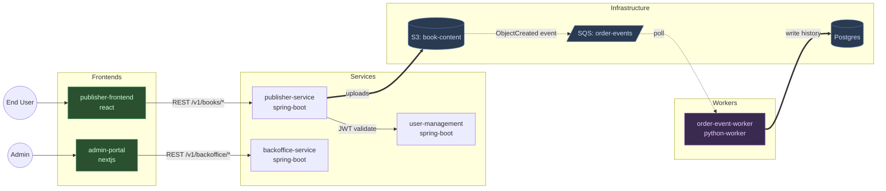

## Phase B2: Architect-led synthesis (Opus)

Launch the `solution-architect` agent in discovery mode. It reads the per-repo profiles produced in B2.0 (NOT raw repo code) and synthesizes the platform context — entity map, integration topology, established patterns, audit findings aggregated, the two architecture diagrams.

**Incremental mode** (`discover_mode == incremental`): dispatch the architect with `MODE: discovery-incremental` instead of `MODE: discovery`, and **merge** its output rather than rewriting. The architect reads the existing `context/platform.md` + `config.json` plus the NEW repos' profiles (only), and produces additive updates: new Service Map / Entity / Integration rows, new cross-repo edges, updated diagrams, and a dated "Added in this run" note — preserving all existing platform.md content. The config build below becomes a **merge**, never an overwrite. Full spec: `{plugin_dir}/rules/incremental-discovery.md` § "Phase B2". The rest of this file describes full mode.

**Tool**: `Agent`
**subagent_type**: `solution-architect`
**description**: `"Onboard — architect synthesis for {workspace.name}"`
**prompt**:

```
MODE: discovery

You are onboarding to a new project: {workspace.name}.
{domain.domain_notes}

This invocation is DISCOVERY MODE — your output is descriptive (what exists in
this system), not prescriptive (what to build). Design-mode invocations happen
later from the /deliver pipeline and read the file you produce here. Do not
propose new architecture, refactors, or technical solutions in this mode.

**Your input is the per-repo profiles from Phase B2.0**, NOT raw repo code.
Phase B2.0 just dispatched a `repo-discoverer` agent per repo (Sonnet, parallel)
and each emitted a structured JSON profile. Your job in B2 is cross-repo
synthesis, not first-time discovery.

PROFILES TO READ (one per repo):
{for each repo in the confirmed list:}
- {repo.name}: {run_dir}/outputs/repo-profiles/{repo.name}.json

Schema for each: {plugin_dir}/templates/blocks/repo-profile.example.json
Field reference: {plugin_dir}/templates/blocks/block-schemas.md § REPO_PROFILE.

Optionally cross-check each profile against `{repo.path}/CLAUDE.md` (when it
exists). Read raw source code ONLY in these explicitly authorized cases:
  (a) a profile's `notes_for_architect` or `constraints_observed` flagged an
      ambiguity you need to resolve;
  (b) a profile flagged an entity with a non-trivial lifecycle (4+ states or
      transition-shaped method hints in `notes_for_architect`) AND your
      `## Status Lifecycles` output for that entity would otherwise be just a
      bare state list. In that case do ONE targeted read on the named service
      file to extract transitions. Do not generalize this — read only the
      flagged file, only for the flagged entity.
Don't re-walk repos the discoverer already enumerated — the profiles are
deliberately structured so you don't have to.

DOMAIN CONTEXT FROM USER:
- Name: {domain.name}
- Description: {domain.domain_notes}
- User roles: {domain.user_roles}
- Languages: {domain.i18n_languages}, RTL: {domain.rtl_support}

CROSS-REPO SYNTHESIS TASKS:
1. **Entity ownership map.** Aggregate `entities[]` from every profile. Cross-reference with `integrations.outbound_*` to identify which service OWNS each entity vs which CONSUMES it. Use the entity-level `purpose` field for the "Description" column when one is present. **Reconcile divergence — do NOT flatten it.** When the same entity name appears in ≥2 profiles, use `entity_kind` to pick the owner (the `authoritative` profile) and compare `key_states`: if they differ, never merge them into one list. Render the authoritative enum as the canonical Key States (citing its `states_source`), then add a note `Projection in {service} adds/omits: {delta states}` for each `projection`/`consumed` copy. A non-trivial divergence also goes to `## Known Constraints` with both `states_source` citations.
2. **Integration topology.** Build the cross-repo graph from each profile's `integrations.{outbound,inbound}_*` fields. The architecture diagrams render this graph.
3. **Service Map descriptions.** The profile's top-level `description` field is a short paragraph (2–4 sentences). For the `## Service Map` table's "Description" column, use the **first sentence** of `description` verbatim — that's the one-liner the discoverer wrote so it stands alone. Then, immediately below the Service Map table, add a `### Service responsibilities` sub-section that renders the **full paragraph** for each service (Service Name as a sub-heading, full description as the body). If a profile's `description` is empty, infer one short sentence from `framework.name` + dominant entity names for the table cell, write a 1-line note for the responsibilities sub-section, and add the entity to `## Open Questions`. Don't fall back to generic stack labels.
4. **Status Lifecycles.** For each entity whose profile lists `key_states`: write the state list, citing the `states_source` (file:line) the discoverer recorded. If the profile flagged a non-trivial lifecycle (per the targeted-read rule above) and you spent a targeted read, render the transitions you extracted. Otherwise list states only and add a one-line note ("Transitions not captured at discovery — see {service-file}"). When two profiles report the same entity with different `key_states` (see Task 1), show the authoritative lifecycle and call out the projection's extra/missing states explicitly — never silently union them. Do not invent transitions you didn't read.
4b. **User Roles & Permissions — from real role values, with citations.** Build the `## User Roles & Permissions` table from the union of every profile's `roles[]` (the actual authority enum), NOT from `domain.user_roles` alone — the product-level list is only a friendly-naming hint and routinely omits roles the code enforces. Use each role's `source` (file:line) as its citation and `description` for the Description column. **Every role↔state and role↔permission claim must be grounded:** cite the `file:line` it derives from (a `roles[].source`, an endpoint's `auth`, or a `@PreAuthorize`/guard the discoverer recorded). If you cannot ground the actor for a transition or permission, state the outcome **without naming an actor** rather than guessing. If `domain.user_roles` names a role no profile's `roles[]` contains, add it to `## Open Questions` (a code role the discoverer missed, or a product role not yet implemented).
5. **Established patterns.** Cross-tabulate `key_conventions[]` across profiles of the same stack. Patterns observed in ≥2 repos go to `## Established Patterns`. Idiosyncratic single-repo patterns stay in their repo's CLAUDE.md (which Phase C generates separately, not you).
6. **Known constraints.** Aggregate divergences (different auth styles in two services of the same stack), incomplete coverage gaps, workspace-wide inconsistencies. Each profile's `constraints_observed[]` feeds this.
7. **Audit findings — elevate criticals only (do NOT write a file).** Phase C (Step 4) collates the single canonical `context/audit-findings.md` from the profiles' `audit_findings[]` PLUS the context-manager's deeper findings, deduped — so don't write an audit-findings.md here. Your only job: surface any CRITICAL finding from the profiles into platform.md § Known Constraints so it's visible in the always-loaded context.
8. **Architecture diagrams** (two files — see diagram rules below).

OUTPUT FORMAT:
Produce the platform context document using the section structure from the template below. Fill in every section with what you discovered — leave none blank. If a section has no data (e.g., no infra repo exists), write "Not applicable — no infrastructure repo in the workspace."

The `## Architect Guidance` section is a STUB — leave it with the exact placeholder content specified below. It is meant for the user (or future onboarding passes) to fill in with workspace-specific design heuristics that future design-mode invocations should apply. Do not populate it from your own discovery; it's a human-edited slot.

TEMPLATE SECTIONS:
## Domain
## Architecture Diagram
## Entities & Ownership (table: Entity | Owning Service | Key States)
## User Roles & Permissions (table: Role | Description | Key Permissions)
## Status Lifecycles
## Service Map (table: Service | Repo | Type | Spec | Description)
## Tech Stack
## Integration Patterns
## Infrastructure Topology
## Established Patterns (all agents must know these)
## Known Constraints
## Open Questions / Evolving Decisions
## Architect Guidance

For the `## Architecture Diagram` section in platform.md, write EXACTLY this pointer content:

    The architecture is captured as two complementary diagrams under the `diagrams/` subdirectory:

    - [`diagrams/architecture-overview.mmd`](./diagrams/architecture-overview.mmd) — **high-level** C4-style
      block diagram for a new team member. ~10 nodes grouped into 4 categories
      (Frontends / Backend services / Queues / Data sources). Read this first.
    - [`diagrams/architecture.mmd`](./diagrams/architecture.mmd) — **detailed** topology with every
      service, DB, queue, Lambda, and specific edge labels. Read this when you
      need to know which endpoint / Feign client / bucket is involved.

    Both are rendered live in the site-view "Project" drawer. Edit the `.mmd`
    files directly to update; re-running `/discover` will prompt before
    overwriting a hand-edited file.

You produce **two diagrams** in this phase, with DIFFERENT rules per diagram.

**Read the full rules file FIRST**, before producing either diagram:

```
{plugin_dir}/rules/discovery-diagrams.md
```

This file contains: the 4-block taxonomy for the overview, the node shape conventions per category, the classDef palette with exact hex codes, the init directive, the 12-item self-check checklist, the lexical-safety rules, and the detailed-diagram conventions. It is the single source of truth for diagramming. Do not rely on memory or reconstruct from examples — read the file at the start of this phase.

### Diagram 1: `architecture-overview.mmd` (high-level, new-joiner friendly)

Apply the "Mermaid conventions for `architecture-overview.mmd` (high-level)" section of the rules file. Key specifics for this workspace:

- The 4 subgraphs (Frontends / Backend services / Queues / Data sources) — no others.
- Short logical labels (`auth_db` not the full `abvi_auth_db`; `books S3` not the full bucket name).
- Cylinder `[(...)]` for ALL data sources including S3, even if the label is long.
- `-->` sync with one-word label, `-.->` async with one-word label. Every edge labeled.
- Target ~10 nodes, 12-15 edges.
- Start with the init directive line from the rules file.
- **Before returning this file, walk the 12-item Self-check at the end of the rules file.** Every item must pass.

### Diagram 2: `architecture.mmd` (detailed topology)

Apply the "Mermaid conventions for `architecture.mmd` (detailed)" section of the rules file. Specifics:

- **Every service** from the Service Map as a node, grouped in `subgraph` blocks by role (Frontends, Services, Workers, Databases, Infrastructure, External).
- **External actors** (user roles, third-party services) as nodes outside the service subgraphs, drawn at the top.
- **Every edge** comes from the Integration Patterns you captured — label each edge with the endpoint prefix, queue/topic name, or resource name so a reader can audit it against the code.
- Choose `graph LR` by default; switch to `graph TB` only if the topology is clearly top-down.

### Output shape expected from you

Produce BOTH diagrams in your reply, clearly labeled, in this order:

```
<!-- BEGIN architecture-overview.mmd -->
```mermaid
%%{init: ...}%%
graph LR
  ... high-level diagram per overview rules ...
```
<!-- END architecture-overview.mmd -->

<!-- BEGIN architecture.mmd -->
```mermaid
graph LR
  ... detailed diagram per detailed rules ...
```
<!-- END architecture.mmd -->
```

Example skeleton for the **detailed** diagram (illustrates the conventions — do NOT copy literally; produce the real topology from the workspace):



For the `## Architect Guidance` section, write EXACTLY this stub content (replace {workspace.name} with the actual name):

    Workspace-specific heuristics for the architect to apply in DESIGN mode
    (during /deliver pipeline invocations). Leave this stub in place if
    empty — the file still loads cleanly.

    Examples of the kind of guidance that belongs here (do NOT write these
    unless they're real for {workspace.name} — this is a template):

    - For any status-transition work, prefer extending the existing workflow
      orchestrator over adding a new service-layer state machine.
    - Cross-service writes go through the established async pattern; never
      introduce new synchronous cross-service DB writes.
    - Never propose RDS schema changes without calling out the migration
      tool (Liquibase / Flyway / Alembic) changeset explicitly.

    (Empty by default. Fill in during or after onboarding.)
```

**After the architect returns**:
1. Save the architect's **full raw output** (the platform.md sections PLUS both `<!-- BEGIN/END *.mmd -->` blocks) to `{run_dir}/outputs/phase-b2-architect-output.md`. This makes the extraction below deterministic and re-runnable on `--resume`. Then write `platform.md` (everything except the two `*.mmd` blocks) to `{workspace_root}/{slug}/context/platform.md`, and `mkdir -p {workspace_root}/{slug}/context/diagrams`.
2. **Extract both diagrams deterministically with `extract-block.js --unfence`** — it pulls the `<!-- BEGIN/END {name} -->` body AND strips the inner ```` ```mermaid ``` ```` fence in one step, so there is no hand fence-stripping to get wrong. For each of `architecture-overview.mmd` and `architecture.mmd`:
   - **Target doesn't exist yet** → extract straight to it:
     ```bash
     node {plugin_dir}/scripts/extract-block.js {run_dir}/outputs/phase-b2-architect-output.md architecture-overview.mmd --unfence > {workspace_root}/{slug}/context/diagrams/architecture-overview.mmd
     ```
     (and the same for `architecture.mmd`).
   - **Target already exists** (re-run or hand-edited) → extract to a temp path first (`{run_dir}/outputs/architecture-overview.mmd`), show a diff vs the existing file, and ask the user **overwrite / merge / keep**. Default **keep** — a hand-edited diagram is load-bearing and must not be silently clobbered. The two files are independent: the user may regenerate one and keep the other.
3. **Verify — deterministic gate (replaces the old "lightweight syntax check"):**
   ```bash
   node {plugin_dir}/scripts/verify-sa-output.js {workspace_root}/{slug}/context
   ```
   Exit `0` = clean. Exit `2` = warnings only (e.g. a period inside a dotted-edge label `-.LABEL.->`, the most common Mermaid footgun — the parser swallows it; surface to the user). Exit `1` = a hard failure (a `.mmd` missing / empty / still wrapped in a code fence, a non-Mermaid first line, or platform.md missing a pointer link or carrying an inline ```` ```mermaid ```` block). On exit 1, fix and re-run before marking Phase B2 complete.

### Build workspace config (config.json)

**Incremental mode**: do NOT rebuild from scratch — **merge** the new repos into the existing `config.json` (deep-copy it, preserve every existing `repos.*` / `services.*` / `domain.*` / `workspace.*` entry and hand-edits, add one entry per new repo + new service, and re-run the `spec_copies` probe across `all_repos` in BOTH directions). Then validate. Full procedure: `{plugin_dir}/rules/incremental-discovery.md` § "Phase B2 → Build workspace config". The "config already exists" warning (CRITICAL RULE 2) does NOT fire here — incremental merges by design. The from-scratch build below is full mode only.

Now that the architect has returned the service map, entity list, and auth discovery, build `{workspace_root}/{slug}/config.json`. **This MUST happen here, at the end of B2 — not in Phase C — because Phase B2.6's observability extractor reads this file** (`extract-observability.js` needs `repos` paths/roles, `services`, and `workspace.envs`). Everything below is available by now: discovered repos (Phase A), domain answers (Phase B1), and the architect's service map / entities / auth (this phase).

Build it from the discovered repos + domain answers:

```js
{
  "workspace": {
    "name": "{from B1 answer 1}",
    "slug": "{derived slug}",
    "primary_language": "{from B1 answer 4}"
  },
  "repos": {
    // one entry per confirmed repo from Phase A
    "{repo-short-name}": {
      "path": "{absolute path}",
      "type": "{detected type}",
      "role": "{detected role}",
      "description": "{from CLAUDE.md or Phase A detection}",
      "spec_file": "{if api-service, the discovered spec path}",
      "spec_copies": { /* if frontend/mock, map service→relative-path */ }
    }
  },
  "services": {
    // one entry per service repo — includes api-services (HTTP) AND workers (event-driven).
    // Both participate in /deliver; spec_policy tells the pipeline which contract phase applies.
    "{service-short-name}": {
      "repo": "{repo key}",
      "spec_policy": "{api-first | code-first | no-api — see below}",
      "spec_file": "{relative spec path — required when spec_policy is api-first, omitted otherwise}",
      "description": "{from architect's service map}"
    }
  },
  "domain": {
    "name": "{from B1}",
    "primary_entities": [/* from architect's entity list */],
    "user_roles": [/* from B1 */],
    "auth_type": "{from architect's discovery}",
    "i18n_languages": [/* from B1 */],
    "rtl_support": /* from B1 */,
    "domain_notes": "{from B1}"
  }
}
```

#### Filling `spec_policy` per service

Carry the value inferred in Phase A Step 3.5 (and confirmed by the user in Step 6) through to the generated config:

| Repo role (from Phase A) | Emitted `services.{name}.spec_policy` | `spec_file` required? |
|---|---|---|
| `api-service` with a discovered spec | `api-first` | yes — use the discovered path |
| `api-service` with no spec | `code-first` | no — omit the field |
| `worker` (python-worker etc.) | `no-api` | no — omit the field |

Do **not** emit `services` entries for repos with `role` of `frontend`, `mock-server`, `infrastructure`, `contract`, or `other` — they are not services.

`schemas` / `api-collections` repos (role `contract`) are tracked only under `repos.*` for now. Future slices will add a `contracts` block that drives Phase 3 ordering.

#### Probing `spec_copies` for every repo

`spec_copies` is **repo-agnostic**. Any repo that keeps a local working copy of another service's OpenAPI spec can declare entries: frontends generating typed clients, mock-servers fabricating responses, api-services with build-time codegen (`openapi-generator-maven-plugin`, `openapitools`, `oapi-codegen`), IaC repos embedding specs into `RestApi.fromOpenApiDefinition` / `aws_api_gateway_rest_api.body`, doc sites (Redocly / Stoplight), contract-test repos (Pact), and SDKs. `/deliver` Phase 4 walks every repo with `spec_copies` regardless of role — so the probe must walk every repo too.

For each api-service's `spec_file` (from Phase A), compute the basename and search **every other repo** in the workspace for that filename. The probe is deliberately filename-only — it does not parse build configs or guess from path patterns. If the file is physically present in a repo with the exact basename, that repo almost certainly consumes it. (False positives are caught by the validator at the end of this step and again at every `/deliver` pre-flight.)

```bash
spec_basename=$(basename "{api-service.spec_file}")

# Walk every repo in the workspace EXCEPT the api-service that owns this spec.
{for each repo in config.repos where repo.path != owning_api_service.path:}
  find {repo.path} -type f -name "$spec_basename" \
    -maxdepth 8 \
    -not -path "*/node_modules/*" -not -path "*/dist/*" -not -path "*/build/*" \
    -not -path "*/target/*" -not -path "*/.git/*" -not -path "*/.next/*" \
    -not -path "*/.claude/*" \
    -not -path "*/__pycache__/*" -not -path "*/venv/*" -not -path "*/.venv/*" \
    | head -1
```

> **Why exclude `.claude/`:** Claude Code / pipecrew create git worktrees under `{repo}/.claude/worktrees/` — each is a *full checkout* of the repo and therefore contains its own copy of every spec file. Without this exclusion the probe matches those transient copies and records a `spec_copies` path pointing into a worktree that may be pruned at any time. Never record a spec copy under `.claude/`.

If a match is found, record the path (relative to the consuming repo's root) under `repos.{consuming_repo}.spec_copies.{service_name}`. If no match is found, **omit the entry** — do not fabricate a plausible path. An empty map is strictly better than guessed paths.

**Skip rules** (the probe does NOT record an entry):
- The consuming repo is the api-service that owns the spec (self-reference).
- The repo's `role` is `contract` (contract repos hold canonical schemas, never copies).
- The matched file lives under the consuming repo's own `spec_file` (the repo's own canonical spec, not a copy).

Also probe with any alternate filenames (e.g., a typo'd spec — ABVI has `user-managment-api-specs.yaml` with a missing `e`). Match by basename as declared in the api-service, not by a cleaned-up name.

Write the file. Run the validator:

```bash
node {plugin_dir}/scripts/validate-config.js {workspace_root}/{slug}/config.json
```

Expect **0 warnings** after the probing step. If validation emits path-not-found warnings for `spec_copies`, the probe missed something — do not ignore; re-run the probe with a wider search (e.g., increase maxdepth, include additional exclude-dir patterns) and fix the paths in config before continuing.

If validation fails with errors, fix and retry. Common errors: repo path typo, missing `type` or `role`.

**Update scratchpad**: set `Workspace config` to COMPLETED in `## Generation Status`.

Present a summary to the user:

```
## Platform Context Generated

The architect analyzed {N} repos and discovered:
- {N} entities across {N} services
- {N} integration patterns (sync/async)
- Tech stack: {summary}
- {N} established patterns identified

Full context saved to: {workspace_root}/{slug}/context/platform.md

Review it? (yes / continue)
```

If the user says "yes", show the platform.md content.

**Update scratchpad**: Set Phase B2 status to COMPLETED. Set Current Phase to "B2.6. Observability Extraction".
