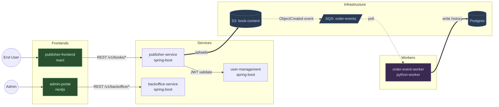

## Phase B2: Architect-led synthesis (Opus)

Launch the `solution-architect` agent in discovery mode. It reads the per-repo profiles produced in B2.0 (NOT raw repo code) and synthesizes the platform context — entity map, integration topology, established patterns, audit findings aggregated, the two architecture diagrams.

**Tool**: `Agent`
**subagent_type**: `solution-architect`
**description**: `"Onboard — architect synthesis for {workspace.name}"`
**prompt**:

```
MODE: discovery

You are onboarding to a new project: {workspace.name}.
{domain.domain_notes}

This invocation is DISCOVERY MODE — your output is descriptive (what exists in
this system), not prescriptive (what to build). Design-mode invocations happen
later from the /deliver pipeline and read the file you produce here. Do not
propose new architecture, refactors, or technical solutions in this mode.

**Your input is the per-repo profiles from Phase B2.0**, NOT raw repo code.
Phase B2.0 just dispatched a `repo-discoverer` agent per repo (Sonnet, parallel)
and each emitted a structured JSON profile. Your job in B2 is cross-repo
synthesis, not first-time discovery.

PROFILES TO READ (one per repo):
{for each repo in the confirmed list:}
- {repo.name}: {run_dir}/outputs/repo-profiles/{repo.name}.json

Schema for each: {plugin_dir}/templates/blocks/repo-profile.example.json
Field reference: {plugin_dir}/templates/blocks/block-schemas.md § REPO_PROFILE.

Optionally cross-check each profile against `{repo.path}/CLAUDE.md` (when it
exists). Read raw source code ONLY in these explicitly authorized cases:
  (a) a profile's `notes_for_architect` or `constraints_observed` flagged an
      ambiguity you need to resolve;
  (b) a profile flagged an entity with a non-trivial lifecycle (4+ states or
      transition-shaped method hints in `notes_for_architect`) AND your
      `## Status Lifecycles` output for that entity would otherwise be just a
      bare state list. In that case do ONE targeted read on the named service
      file to extract transitions. Do not generalize this — read only the
      flagged file, only for the flagged entity.
Don't re-walk repos the discoverer already enumerated — the profiles are
deliberately structured so you don't have to.

DOMAIN CONTEXT FROM USER:
- Name: {domain.name}
- Description: {domain.domain_notes}
- User roles: {domain.user_roles}
- Languages: {domain.i18n_languages}, RTL: {domain.rtl_support}

CROSS-REPO SYNTHESIS TASKS:
1. **Entity ownership map.** Aggregate `entities[]` from every profile. Cross-reference with `integrations.outbound_*` to identify which service OWNS each entity vs which CONSUMES it. Use the entity-level `purpose` field for the "Description" column when one is present.
2. **Integration topology.** Build the cross-repo graph from each profile's `integrations.{outbound,inbound}_*` fields. The architecture diagrams render this graph.
3. **Service Map descriptions.** The profile's top-level `description` field is a short paragraph (2–4 sentences). For the `## Service Map` table's "Description" column, use the **first sentence** of `description` verbatim — that's the one-liner the discoverer wrote so it stands alone. Then, immediately below the Service Map table, add a `### Service responsibilities` sub-section that renders the **full paragraph** for each service (Service Name as a sub-heading, full description as the body). If a profile's `description` is empty, infer one short sentence from `framework.name` + dominant entity names for the table cell, write a 1-line note for the responsibilities sub-section, and add the entity to `## Open Questions`. Don't fall back to generic stack labels.
4. **Status Lifecycles.** For each entity whose profile lists `key_states`: write the state list. If the profile flagged a non-trivial lifecycle (per the targeted-read rule above) and you spent a targeted read, render the transitions you extracted. Otherwise list states only and add a one-line note ("Transitions not captured at discovery — see {service-file}"). Do not invent transitions you didn't read.
5. **Established patterns.** Cross-tabulate `key_conventions[]` across profiles of the same stack. Patterns observed in ≥2 repos go to `## Established Patterns`. Idiosyncratic single-repo patterns stay in their repo's CLAUDE.md (which Phase C generates separately, not you).
6. **Known constraints.** Aggregate divergences (different auth styles in two services of the same stack), incomplete coverage gaps, workspace-wide inconsistencies. Each profile's `constraints_observed[]` feeds this.
7. **Audit findings consolidation.** Aggregate `audit_findings[]` from every profile into a single audit-findings.md, severity-grouped (CRITICAL / HIGH / MEDIUM / LOW), then by repo within each severity.
8. **Architecture diagrams** (two files — see diagram rules below).

OUTPUT FORMAT:
Produce the platform context document using the section structure from the template below. Fill in every section with what you discovered — leave none blank. If a section has no data (e.g., no infra repo exists), write "Not applicable — no infrastructure repo in the workspace."

The `## Architect Guidance` section is a STUB — leave it with the exact placeholder content specified below. It is meant for the user (or future onboarding passes) to fill in with workspace-specific design heuristics that future design-mode invocations should apply. Do not populate it from your own discovery; it's a human-edited slot.

TEMPLATE SECTIONS:
## Domain
## Architecture Diagram
## Entities & Ownership (table: Entity | Owning Service | Key States)
## User Roles & Permissions (table: Role | Description | Key Permissions)
## Status Lifecycles
## Service Map (table: Service | Repo | Type | Spec | Description)
## Tech Stack
## Integration Patterns
## Infrastructure Topology
## Established Patterns (all agents must know these)
## Known Constraints
## Open Questions / Evolving Decisions
## Architect Guidance

For the `## Architecture Diagram` section in platform.md, write EXACTLY this pointer content:

    The architecture is captured as two complementary diagrams under the `diagrams/` subdirectory:

    - [`diagrams/architecture-overview.mmd`](./diagrams/architecture-overview.mmd) — **high-level** C4-style
      block diagram for a new team member. ~10 nodes grouped into 4 categories
      (Frontends / Backend services / Queues / Data sources). Read this first.
    - [`diagrams/architecture.mmd`](./diagrams/architecture.mmd) — **detailed** topology with every
      service, DB, queue, Lambda, and specific edge labels. Read this when you
      need to know which endpoint / Feign client / bucket is involved.

    Both are rendered live in the site-view "Project" drawer. Edit the `.mmd`
    files directly to update; re-running `/discover` will prompt before
    overwriting a hand-edited file.

You produce **two diagrams** in this phase, with DIFFERENT rules per diagram.

**Read the full rules file FIRST**, before producing either diagram:

```
{plugin_dir}/rules/discovery-diagrams.md
```

This file contains: the 4-block taxonomy for the overview, the node shape conventions per category, the classDef palette with exact hex codes, the init directive, the 12-item self-check checklist, the lexical-safety rules, and the detailed-diagram conventions. It is the single source of truth for diagramming. Do not rely on memory or reconstruct from examples — read the file at the start of this phase.

### Diagram 1: `architecture-overview.mmd` (high-level, new-joiner friendly)

Apply the "Mermaid conventions for `architecture-overview.mmd` (high-level)" section of the rules file. Key specifics for this workspace:

- The 4 subgraphs (Frontends / Backend services / Queues / Data sources) — no others.
- Short logical labels (`auth_db` not the full `abvi_auth_db`; `books S3` not the full bucket name).
- Cylinder `[(...)]` for ALL data sources including S3, even if the label is long.
- `-->` sync with one-word label, `-.->` async with one-word label. Every edge labeled.
- Target ~10 nodes, 12-15 edges.
- Start with the init directive line from the rules file.
- **Before returning this file, walk the 12-item Self-check at the end of the rules file.** Every item must pass.

### Diagram 2: `architecture.mmd` (detailed topology)

Apply the "Mermaid conventions for `architecture.mmd` (detailed)" section of the rules file. Specifics:

- **Every service** from the Service Map as a node, grouped in `subgraph` blocks by role (Frontends, Services, Workers, Databases, Infrastructure, External).
- **External actors** (user roles, third-party services) as nodes outside the service subgraphs, drawn at the top.
- **Every edge** comes from the Integration Patterns you captured — label each edge with the endpoint prefix, queue/topic name, or resource name so a reader can audit it against the code.
- Choose `graph LR` by default; switch to `graph TB` only if the topology is clearly top-down.

### Output shape expected from you

Produce BOTH diagrams in your reply, clearly labeled, in this order:

```
<!-- BEGIN architecture-overview.mmd -->
```mermaid
%%{init: ...}%%
graph LR
  ... high-level diagram per overview rules ...
```
<!-- END architecture-overview.mmd -->

<!-- BEGIN architecture.mmd -->
```mermaid
graph LR
  ... detailed diagram per detailed rules ...
```
<!-- END architecture.mmd -->
```

Example skeleton for the **detailed** diagram (illustrates the conventions — do NOT copy literally; produce the real topology from the workspace):



For the `## Architect Guidance` section, write EXACTLY this stub content (replace {workspace.name} with the actual name):

    Workspace-specific heuristics for the architect to apply in DESIGN mode
    (during /deliver pipeline invocations). Leave this stub in place if
    empty — the file still loads cleanly.

    Examples of the kind of guidance that belongs here (do NOT write these
    unless they're real for {workspace.name} — this is a template):

    - For any status-transition work, prefer extending the existing workflow
      orchestrator over adding a new service-layer state machine.
    - Cross-service writes go through the established async pattern; never
      introduce new synchronous cross-service DB writes.
    - Never propose RDS schema changes without calling out the migration
      tool (Liquibase / Flyway / Alembic) changeset explicitly.

    (Empty by default. Fill in during or after onboarding.)
```

**After the architect returns**:
1. Save the platform.md output (everything except the two mermaid blocks) to `{workspace_root}/{slug}/context/platform.md`.
2. Extract the block delimited by `<!-- BEGIN architecture-overview.mmd -->` / `<!-- END architecture-overview.mmd -->`. Strip the inner ```` ```mermaid ... ``` ```` fence and save the Mermaid source to `{workspace_root}/{slug}/context/diagrams/architecture-overview.mmd` (create `diagrams/` if it doesn't exist).
3. Extract the block delimited by `<!-- BEGIN architecture.mmd -->` / `<!-- END architecture.mmd -->`. Strip the inner ```` ```mermaid ... ``` ```` fence and save to `{workspace_root}/{slug}/context/diagrams/architecture.mmd`.
4. Verify the `## Architecture Diagram` section in platform.md contains the pointer stub pointing to BOTH files, not the full mermaid source for either.

**If either `.mmd` file already exists** (re-run or hand-edited): show a diff for that specific file and ask the user whether to overwrite, merge, or keep. Default is **keep** for each — a hand-edited diagram is load-bearing and must not be silently clobbered. The two files are treated independently: the user may choose to regenerate the overview but keep the detailed, or vice versa.

**Render check**: before marking Phase B2 complete, validate both Mermaid files parse cleanly. Run a lightweight syntax check (or defer to the site-view render error) and surface any lexical errors to the user — most common cause is a period inside a dotted-edge label (`-.LABEL.->`) which the parser swallows.

Present a summary to the user:

```
## Platform Context Generated

The architect analyzed {N} repos and discovered:
- {N} entities across {N} services
- {N} integration patterns (sync/async)
- Tech stack: {summary}
- {N} established patterns identified

Full context saved to: {workspace_root}/{slug}/context/platform.md

Review it? (yes / continue)
```

If the user says "yes", show the platform.md content.

**Update scratchpad**: Set Phase B2 status to COMPLETED. Set Current Phase to "B2.6. Observability Extraction".
